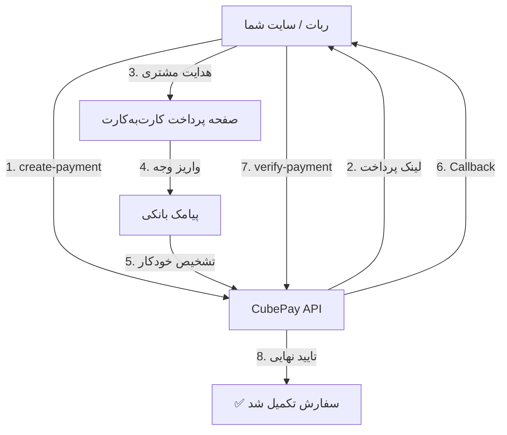

<p align="center">
  
</p>

<p align="center">
  <a href="https://github.com/cubepy/cubepay-doc/releases"></a>
  <a href="https://github.com/cubepy/cubepay-doc/blob/main/LICENSE"></a>
  <a href="https://github.com/cubepy/cubepay-doc/stargazers"></a>
  <a href="https://github.com/cubepy/cubepay-doc/network/members"></a>
  <a href="https://github.com/cubepy/cubepay-doc/issues"></a>
  <a href="https://github.com/cubepy/cubepay-doc/pulls"></a>
  <a href="https://github.com/cubepy/cubepay-doc/commits/main"></a>
</p>

<h1 align="center">💳 CubePay</h1>

<p align="center">
پرداخت کارت‌به‌کارت با تایید خودکار پیامکی — بدون نیاز به درگاه بانکی رسمی، بدون کارمزد شتاب 🚀
</p>

CubePay یک API ساده برای ساخت و تایید تراکنش‌های کارت‌به‌کارت است. مشتری شما مبلغ رو مستقیم به کارت شما واریز می‌کنه و تاییدش کاملاً خودکار (از روی پیامک بانکی) انجام می‌شه — دقیقاً مثل یک درگاه پرداخت، ولی بدون نیاز به نماد و ثبت درگاه رسمی.

> 📌 **این ریپو مستندات یک سرویس API آنلاین است، نه یک کتابخانه‌ی قابل نصب.** برای استفاده فقط کافیه به آدرس‌های API با HTTP درخواست بزنید — نیازی به نصب پکیج یا وابستگی خاصی نیست.

<!-- برای نمایش دمو، یک اسکرین‌شات یا GIF واقعی از پروسه‌ی پرداخت/ربات را در پوشه‌ی assets/ قرار داده و خط زیر را از حالت کامنت خارج کنید:

-->

---

## ✨ امکانات

- ✅ تایید خودکار پرداخت (Auto Confirmation از روی پیامک بانکی)
- ✅ Callback خودکار به سرور شما
- ✅ محافظت در برابر تایید دوباره‌ی یک تراکنش (idempotent verify)
- ✅ بدون نیاز به درگاه بانکی رسمی یا نماد
- ✅ مدیریت فروشندگان از طریق ربات تلگرام (`@cubepy_bot`)
- ✅ نمونه کد آماده برای PHP، Python، Node.js، Laravel و cURL

---

## 📚 فهرست مطالب

- [شروع سریع](#-شروع-سریع)
- [نحوه‌ی کار سیستم](#-نحوه‌ی-کار-سیستم)
- [ایجاد تراکنش (Create Payment)](#-ایجاد-تراکنش-create-payment)
- [تایید تراکنش (Verify Payment)](#-تایید-تراکنش-verify-payment)
- [اعتبار و قوانین تراکنش](#-اعتبار-و-قوانین-تراکنش)
- [Webhook / Callback](#-اطلاعات-ارسالی-به-callback_url)
- [نمونه کدها](#-نمونه-کدها)
- [مقایسه با روش‌های دیگر](#-مقایسه-با-روش‌های-دیگر)
- [کدها و پیام‌های رایج (خطاها)](#️-کدها-و-پیام‌های-رایج)
- [عیب‌یابی (Troubleshooting)](#-عیب‌یابی-troubleshooting)
- [سوالات متداول (FAQ)](#-سوالات-متداول)
- [مشارکت (Contributing)](#-مشارکت)
- [امنیت](#-امنیت)
- [تغییرات نسخه‌ها](#-تغییرات-نسخه‌ها)
- [لینک‌ها](#-لینک‌ها)

---

## 🚀 شروع سریع

برای استفاده از API نیاز به یک **توکن دسترسی (API Token)** دارید. این توکن رو از ربات مدیریت فروشندگان (`@cubepy_bot`) بعد از ثبت‌نام و تایید حساب دریافت می‌کنید.

توکن باید در هدر هر درخواست به این شکل ارسال بشه:

```
Authorization: Bearer YOUR_API_TOKEN
```

⚠️ نکته‌ی مهم: برخلاف بعضی درگاه‌ها، آدرس‌های زیر با پسوند `.php` هستن — حتماً دقیقاً همون‌طور که تو پنل فروشنده‌تون نوشته کپی کنید.

---

## 🧭 نحوه‌ی کار سیستم



اگر مرورگر یا صفحه‌ی نمایش شما مرمید (Mermaid) رو رندر نمی‌کنه، نسخه‌ی متنی همون فلوی بالا:

```
ربات شما → CubePay API → صفحه پرداخت → پیامک بانکی
    → تشخیص خودکار → Callback به ربات شما → verify-payment → سفارش تکمیل شد
```

---

## 🛒 ایجاد تراکنش (Create Payment)

**Endpoint:**

```
POST https://cubevps.ir/smspay/api/create-payment.php
```

### 📋 پارامترها

| نام                | نوع    | اجباری | توضیحات                                             |
| ------------------ | ------ | ------ | ----------------------------------------------------- |
| `amount`           | int    | ✅      | مبلغ تراکنش به **ریال** (حداقل ۱۰۰۰ ریال)           |
| `order_id`         | string | ✅      | شناسه‌ی یکتای سفارش شما                             |
| `callback_url`     | string | ✅      | آدرسی که بعد از پرداخت موفق به آن اطلاع داده می‌شود |
| `type`             | string | ✅      | فعلاً فقط `card`                                    |
| `customer_user_id` | string | ❌      | شناسه‌ی مشتری شما (مثلاً آیدی عددی تلگرام)          |
| `description`      | string | ❌      | توضیح سفارش                                         |

### ✅ نمونه پاسخ موفق

```json
{
  "success": true,
  "authority": "bdc9e0497c121d6187750d53798dae81",
  "payment_link": "https://cubevps.ir/smspay/pay.php?authority=bdc9e0497c121d6187750d53798dae81",
  "pay_amount": 200720,
  "pay_amount_toman": 20072
}
```

📌 **`pay_amount_toman` را جدی بگیرید:** این مبلغ دقیق قابل‌پرداخت است، نه لزوماً همون عددی که خودتون فرستادید. سیستم برای اینکه بتونه پیامک‌های بانکی رو دقیق تشخیص بده، چند تومان تصادفی به مبلغ اضافه می‌کنه (مثلاً ۲۰,۰۰۰ می‌شه ۲۰,۰۷۲). **لینک `payment_link` رو مستقیم به مشتری بدید** — خود صفحه‌ی پرداخت این مبلغ دقیق رو به‌وضوح نشون می‌ده.

### ❌ نمونه پاسخ خطا

```json
{
  "success": false,
  "message": "مبلغ نامعتبر است (ریال، حداقل ۱۰۰۰)."
}
```

---

## 🔍 تایید تراکنش (Verify Payment)

**Endpoint:**

```
POST https://cubevps.ir/smspay/api/verify-payment.php
```

### 📋 پارامترها

| نام         | نوع    | اجباری | توضیحات                                        |
| ----------- | ------ | ------ | ------------------------------------------------ |
| `authority` | string | ✅      | کدی که از مرحله‌ی ایجاد تراکنش دریافت کرده‌اید |

### ✅ نمونه پاسخ (اولین تایید موفق)

```json
{
  "success": true,
  "message": "پرداخت تایید شد.",
  "order_id": "ORD123",
  "amount": 200000,
  "status": "verified"
}
```

### 📌 پاسخ‌های دیگر (بسته به وضعیت فعلی تراکنش)

| وضعیت                | HTTP Status | معنی                                                    |
| -------------------- | ----------- | -------------------------------------------------------- |
| `verified` (تکراری)  | `409`       | این تراکنش قبلاً یک‌بار تایید شده — دوباره سرویس نسازید |
| `pending`            | `402`       | هنوز پرداختی ثبت نشده                                   |
| `expired` / `failed` | `410`       | مهلت تراکنش تمام شده یا ناموفق بوده                     |
| authority نامعتبر    | `404`       | چنین تراکنشی یافت نشد                                   |

⚠️ فقط **اولین** فراخوانی موفق `verify-payment` مقدار `success: true` برمی‌گردونه. این عمداً این‌طوریه تا اگه به‌هر دلیلی (رفرش کاربر، تلاش دوباره‌ی خودتون و…) دوبار صدا زده بشه، سرویس/شارژ رو دوبار به کاربر ندید.

---

## ⏳ اعتبار و قوانین تراکنش

- هر فاکتور **۳۰ دقیقه** اعتبار داره؛ بعدش منقضی می‌شه و پرداخت دیگه امکان‌پذیر نیست.
- اگه با یک `order_id` تکراری دوباره `create-payment` بزنید، و فاکتور قبلی هنوز **در انتظار پرداخت** باشه، همون `authority`/`payment_link` قبلی برگردونده می‌شه (فاکتور جدید ساخته نمی‌شه).
- مبلغ‌ها همه‌جا (درخواست و پاسخ) به **ریال** هستن، مگر جایی که صراحتاً «تومان» نوشته شده باشه (مثل `pay_amount_toman`).

---

## 🔄 اطلاعات ارسالی به `callback_url`

به‌محض تشخیص واریز (از روی پیامک بانکی)، این درخواست به آدرس `callback_url` شما ارسال می‌شه:

**به‌صورت POST (بدنه‌ی JSON):**

```json
{
  "success": true,
  "status": "paid",
  "authority": "bdc9e0497c121d6187750d53798dae81",
  "order_id": "ORD123",
  "amount": 200000
}
```

**و همزمان به‌صورت querystring هم به همون آدرس اضافه می‌شه** (برای سازگاری با بک‌اندهایی که فقط GET رو می‌خونن):

```
?authority=...&order_id=...&status=paid
```

📌 بعد از دریافت این کال‌بک، حتماً `verify-payment` رو صدا بزنید تا مطمئن بشید (این کال‌بک صرفاً یه اطلاع‌رسانیه، نه تاییدیه‌ی نهایی).

---

## 💻 نمونه کدها

### 🐘 PHP

```php
<?php
$accessToken = "YOUR_API_TOKEN";

$data = [
    "amount" => 200000,
    "order_id" => "ORD123",
    "callback_url" => "https://yourbot.example.com/callback.php",
    "type" => "card",
    "description" => "شارژ کیف پول",
    "customer_user_id" => "123456789",
];

$ch = curl_init("https://cubevps.ir/smspay/api/create-payment.php");
curl_setopt($ch, CURLOPT_RETURNTRANSFER, true);
curl_setopt($ch, CURLOPT_POST, true);
curl_setopt($ch, CURLOPT_POSTFIELDS, json_encode($data, JSON_UNESCAPED_UNICODE));
curl_setopt($ch, CURLOPT_HTTPHEADER, [
    "Content-Type: application/json",
    "Authorization: Bearer {$accessToken}",
]);

$response = curl_exec($ch);
$result = json_decode($response, true);

if (!empty($result['success'])) {
    echo "لینک پرداخت: " . $result['payment_link'];
} else {
    echo "خطا: " . $result['message'];
}
```

### 🐍 Python

```python
import requests

url = "https://cubevps.ir/smspay/api/create-payment.php"
headers = {
    "Content-Type": "application/json",
    "Authorization": "Bearer YOUR_API_TOKEN",
}
data = {
    "amount": 200000,
    "order_id": "ORD123",
    "callback_url": "https://yourbot.example.com/callback",
    "type": "card",
    "description": "شارژ کیف پول",
}

response = requests.post(url, json=data, headers=headers)
print(response.json())
```

### 🟢 Node.js

```javascript
const axios = require("axios");

const data = {
  amount: 200000,
  order_id: "ORD123",
  callback_url: "https://yourbot.example.com/callback",
  type: "card",
};

axios.post("https://cubevps.ir/smspay/api/create-payment.php", data, {
  headers: {
    "Content-Type": "application/json",
    "Authorization": "Bearer YOUR_API_TOKEN",
  },
})
  .then((res) => console.log(res.data))
  .catch((err) => console.error(err.response?.data));
```

### 🎯 Laravel

```php
use Illuminate\Support\Facades\Http;

$response = Http::withToken(config('services.cubepay.token'))
    ->post('https://cubevps.ir/smspay/api/create-payment.php', [
        'amount' => 200000,
        'order_id' => 'ORD123',
        'callback_url' => route('cubepay.callback'),
        'type' => 'card',
        'description' => 'شارژ کیف پول',
    ]);

if ($response->json('success')) {
    return redirect($response->json('payment_link'));
}

abort(422, $response->json('message'));
```

### 💻 cURL

```bash
curl -X POST https://cubevps.ir/smspay/api/create-payment.php \
  -H "Content-Type: application/json" \
  -H "Authorization: Bearer YOUR_API_TOKEN" \
  -d '{
    "amount": 200000,
    "order_id": "ORD123",
    "callback_url": "https://yourbot.example.com/callback",
    "type": "card"
  }'
```

---

## ⚖️ مقایسه با روش‌های دیگر

| ویژگی                       | CubePay | درگاه بانکی رسمی | کارت‌به‌کارت دستی |
| ----------------------------- | :-----: | :----------------: | :------------------: |
| نیاز به نماد/ثبت درگاه        |   ❌    |         ✅          |          ❌           |
| تایید خودکار پرداخت           |   ✅    |         ✅          |          ❌           |
| کارمزد شتاب                   |   ❌    |         ✅          |          ❌           |
| Callback خودکار               |   ✅    |         ✅          |          ❌           |
| مدیریت از طریق ربات تلگرام    |   ✅    |         ❌          |          ❌           |
| زمان راه‌اندازی               | چند دقیقه | چند روز/هفته      |         فوری          |

> این جدول صرفاً برای مقایسه‌ی فنی امکانات است؛ برای تصمیم‌گیری، شرایط قانونی و کارمزد واقعی هر روش رو خودتون بررسی کنید.

---

## ⚠️ کدها و پیام‌های رایج

| پیام                                  | HTTP Status | دلیل                                                            |
| --------------------------------------- | ----------- | ------------------------------------------------------------------ |
| توکن ارسال نشده / نامعتبر است         | `401`       | هدر Authorization خالیه یا توکن اشتباهه                         |
| حساب فروشندگی شما هنوز تایید نشده...  | `403`       | هنوز ادمین درخواست شما رو تایید نکرده                           |
| مبلغ نامعتبر است                      | `422`       | کمتر از ۱۰۰۰ ریال یا عدد نیست                                   |
| order_id / callback_url نامعتبر است   | `422`       | فرمت یا طول اشتباهه (callback باید https معتبر و غیرداخلی باشه) |
| موجودی کیف‌پول کارمزد کافی نیست       | `402`       | باید کیف‌پول کارمزدتون رو شارژ کنید                             |
| ظرفیت فاکتور همزمان پر است            | `503`       | خیلی به‌ندرت پیش میاد؛ چند لحظه بعد دوباره امتحان کنید          |

---

## 🛠 عیب‌یابی (Troubleshooting)

**❌ خطای 401 Unauthorized**
- مطمئن بشید هدر رو دقیقاً به‌شکل `Authorization: Bearer YOUR_API_TOKEN` می‌فرستید (نه فقط توکن خام).
- بررسی کنید فاصله یا کاراکتر اضافه‌ای موقع کپی توکن وارد نشده باشه.
- توکن رو از پنل ربات (`@cubepy_bot`) دوباره چک/رجنریت کنید.

**❌ Webhook / Callback دریافت نمی‌شود**
- آدرس `callback_url` باید **https** معتبر و از بیرون قابل‌دسترس باشه (نه `localhost` یا IP داخلی).
- فایروال یا Cloudflare سمت سرور خودتون رو چک کنید که درخواست POST از سمت CubePay بلاک نشه.
- لاگ سرور خودتون رو برای درخواست‌های دریافتی به مسیر callback بررسی کنید.

**❌ Connection Timeout**
- اتصال شبکه‌ی سرور شما به `cubevps.ir` رو با `curl -I https://cubevps.ir` تست کنید.
- اگه از سرور داخل ایران با تحریم شبکه یا فیلترینگ مواجهید، DNS/مسیر شبکه رو بررسی کنید.

**❌ SSL Error**
- مطمئن بشید نسخه‌ی cURL/OpenSSL سرورتون به‌روز است.
- در محیط توسعه هرگز `CURLOPT_SSL_VERIFYPEER` رو `false` نکنید؛ در عوض CA certificate سیستم رو آپدیت کنید.

**❌ `verify-payment` همیشه `pending` برمی‌گردونه**
- تراکنش هنوز واریز نشده یا پیامک بانکی هنوز پردازش نشده — چند ثانیه صبر کنید و دوباره تلاش کنید (پیش از انقضای ۳۰ دقیقه‌ای فاکتور).

---

## ❓ سوالات متداول

**آیا نیاز به درگاه بانکی رسمی دارم؟**
❌ نه، فقط یک کارت بانکی به نام خودتون کافیه.

**فاکتورها چند دقیقه اعتبار دارن؟**
⏳ ۳۰ دقیقه.

**اگه پیامک بانک دیر برسه چی؟**
تا وقتی فاکتور منقضی نشده، تشخیص انجام می‌شه؛ تاخیر پیامک بانک معمولاً چند ثانیه‌ست.

**چطور توکن یا کارتم رو عوض کنم؟**
از منوی ربات مدیریت فروشندگان (`@cubepy_bot`).

**آیا از PHP پشتیبانی می‌شه؟**
✅ بله، چون API عمومی و مبتنی بر HTTP/JSON هست، از هر زبانی (PHP, Python, Node.js, و غیره) قابل استفاده‌ست. نمونه کد PHP در بخش [نمونه کدها](#-نمونه-کدها) موجوده.

**آیا از Node.js پشتیبانی می‌شه؟**
✅ بله، به همون دلیل بالا — نمونه کد Node.js هم موجوده.

**آیا می‌تونم از SQLite برای ذخیره‌ی تراکنش‌ها استفاده کنم؟**
✅ بله، CubePay هیچ محدودیتی روی دیتابیس سمت شما نمی‌ذاره. شما فقط `order_id` و `authority` رو ذخیره می‌کنید و انتخاب دیتابیس (SQLite, MySQL, PostgreSQL, ...) کاملاً به خودتون بستگی داره.

**چطور Auto Confirmation رو فعال کنم؟**
تایید خودکار به‌صورت پیش‌فرض روی همه‌ی حساب‌های تاییدشده فعاله و نیازی به تنظیم اضافه‌ای نیست؛ کافیه شماره‌ی بانکی متصل به ربات رو درست ثبت کرده باشید.

---

## 🤝 مشارکت

برای گزارش باگ، پیشنهاد ویژگی جدید یا ارسال Pull Request، فایل [CONTRIBUTING.md](./CONTRIBUTING.md) رو ببینید.

## 🔒 امنیت

اگه یک آسیب‌پذیری امنیتی پیدا کردید، لطفاً طبق فایل [SECURITY.md](./SECURITY.md) اون رو به‌صورت خصوصی گزارش بدید و از باز کردن Issue عمومی خودداری کنید.

## 📝 تغییرات نسخه‌ها

تاریخچه‌ی کامل تغییرات در فایل [CHANGELOG.md](./CHANGELOG.md) موجوده.

---

## 📌 نکات مهم

✔ مبلغ‌ها همه‌جا به **ریال** ارسال/دریافت می‌شن (تومان × ۱۰)
✔ فعلاً فقط `type: "card"` پشتیبانی می‌شه
✔ همیشه از `pay_amount_toman` برای نمایش مبلغ نهایی به مشتری استفاده کنید، نه مبلغ خام درخواستی
✔ اگه بین شما و پلتفرم توافق کارمزد وجود داشته باشه، محاسبه‌ش کاملاً خودکاره — نیازی نیست خودتون چیزی به مبلغ اضافه کنید
✔ `verify-payment` رو فقط یک‌بار در ازای هر تراکنش، بعد از دریافت کال‌بک صدا بزنید

---

## 🔗 لینک‌ها

🤖 ربات مدیریت فروشندگان: [@cubepy_bot](https://t.me/cubepy_bot)
