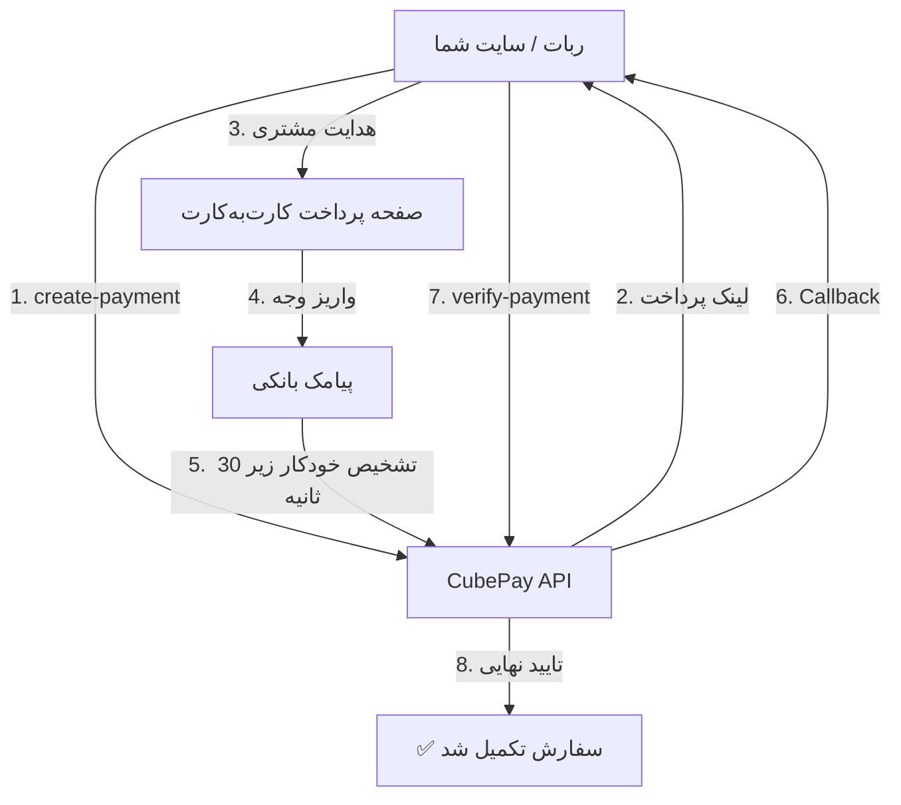

<p align="center">
  
</p>

<p align="center">
  <a href="https://github.com/cubepy/cubepay-doc/releases"></a>
  <a href="https://github.com/cubepy/cubepay-doc/blob/main/LICENSE"></a>
  <a href="https://github.com/cubepy/cubepay-doc/stargazers"></a>
  <a href="https://github.com/cubepy/cubepay-doc/network/members"></a>
  <a href="https://github.com/cubepy/cubepay-doc/issues"></a>
  <a href="https://github.com/cubepy/cubepay-doc/pulls"></a>
  <a href="https://github.com/cubepy/cubepay-doc/commits/main"></a>
</p>

<h1 align="center">💳 CubePay</h1>

<p align="center">
هر واریز، خودش را تأیید می‌کند — پرداخت کارت‌به‌کارت با تشخیص خودکار پیامک بانکی 🚀
</p>

CubePay یک سرویس API برای ساخت و تأیید خودکار تراکنش‌های کارت‌به‌کارت است. مشتری شما مبلغ رو مستقیم به کارت شما واریز می‌کنه؛ سیستم از روی پیامک بانکی، پرداخت رو در کمتر از ۳۰ ثانیه تشخیص و تأیید می‌کنه — بدون نیاز به نماد اعتماد الکترونیکی (اینماد)، بدون نیاز به درگاه بانکی رسمی و بدون کارمزد شتاب.

> 📌 این ریپو مستندات یک سرویس API آنلاین است، نه یک کتابخانه‌ی قابل نصب. برای شروع فقط به یک توکن API از [@cubepy_bot](https://t.me/cubepy_bot) نیاز دارید.

**تازه‌کار هستید؟ 👉 از اینجا شروع کنید: [START-HERE.md](./START-HERE.md)**

---

## ✨ امکانات

| | |
|---|---|
| ✅ تأیید خودکار پرداخت (زیر ۳۰ ثانیه) | ✅ Callback خودکار به سرور شما |
| ✅ محافظت در برابر تأیید دوباره (idempotent) | ✅ بدون نیاز به نماد یا درگاه رسمی |
| ✅ مدیریت کامل از طریق ربات تلگرام | ✅ ساخت فاکتور دستی از پنل |
| ✅ کیف پول و مدیریت چند کارت | ✅ گزارش کامل تراکنش‌ها |
| ✅ همکار حساب (چند مدیر) | ✅ اتصال HTTPS رمزنگاری‌شده |

🔐 **امنیت:** بدون ذخیره‌سازی اطلاعات کارت خریدار · قفل اتمیک کیف پول (Atomic Wallet Lock) · پشتیبانی مستقیم و پاسخ‌گویی واقعی

---

## 🗂 نقشه‌ی مستندات این ریپو

```
cubepay-doc/
├── START-HERE.md                 ← تازه‌کارید؟ اول این رو بخونید
├── docs/
│   ├── API-REFERENCE.md          ← مرجع کامل فنی API (Endpoints, پارامترها, خطاها)
│   ├── FAQ.md                    ← سوالات متداول
│   ├── openapi.yaml              ← اسپک OpenAPI 3.0 (برای Postman/Swagger)
│   └── examples/                 ← نمونه کد آماده به ازای هر زبان
│       ├── CubePayClient.php
│       ├── php-example.php
│       ├── python-example.py
│       ├── node-example.js
│       ├── laravel-example.php
│       └── curl-example.sh
└── integrations/                 ← راهنمای اتصال به پلتفرم‌های خاص
    ├── generic-integration-guide.md
    ├── wordpress-plugin-guide.md
    ├── faoxima-integration-guide.md
    └── faoxima-ready-files/
        └── faoxima-ready-files-guide.md
```

---

## 🔌 اتصال به پلتفرم‌های آماده

اگه از یکی از این پلتفرم‌ها استفاده می‌کنید، لازم نیست خودتون API رو صفر تا صد پیاده‌سازی کنید:

| پلتفرم | راهنما | توضیح |
|---|---|---|
| 🤖 **Foxima** (و فورک‌هاش) | [نصب با فایل آماده](./integrations/faoxima-ready-files/faoxima-ready-files-guide.md) | فقط چند فایل PHP رو جایگزین می‌کنید — سریع‌ترین روش |
| 🤖 **Foxima** (ویرایش دستی) | [راهنمای اتصال دستی](./integrations/faoxima-integration-guide.md) | اگه فایل‌های ربات‌تون شخصی‌سازی شده و نمی‌خواید کامل جایگزین بشه |
| 🌐 **وردپرس / ووکامرس** | [راهنمای وردپرس](./integrations/wordpress-plugin-guide.md) | نصب CubePay روی فروشگاه وردپرسی |
| ⚙️ **هر پلتفرم دیگه** | [راهنمای اتصال عمومی](./integrations/generic-integration-guide.md) | اتصال مستقیم به API، مستقل از پلتفرم |

---

## 🚀 شروع سریع (خلاصه)

```
Authorization: Bearer YOUR_API_TOKEN
```

```
POST https://cubevps.ir/smspay/api/create-payment.php
POST https://cubevps.ir/smspay/api/verify-payment.php
```

جزئیات کامل پارامترها، پاسخ‌ها، کدهای خطا و قوانین تراکنش در 👉 **[docs/API-REFERENCE.md](./docs/API-REFERENCE.md)**

نمونه کد در PHP، Python، Node.js، Laravel و cURL 👉 **[docs/examples/](./docs/examples/)**

---

## 🧭 نحوه‌ی کار سیستم



---

## ⚖️ مقایسه با روش‌های دیگر

| ویژگی | CubePay | درگاه بانکی رسمی | کارت‌به‌کارت دستی |
|---|:---:|:---:|:---:|
| نیاز به نماد/ثبت درگاه | ❌ | ✅ | ❌ |
| تأیید خودکار پرداخت | ✅ | ✅ | ❌ |
| کارمزد شتاب | ❌ | ✅ | ❌ |
| Callback خودکار | ✅ | ✅ | ❌ |
| مدیریت از طریق ربات تلگرام | ✅ | ❌ | ❌ |
| زمان راه‌اندازی | چند دقیقه | چند روز/هفته | فوری |

> این جدول صرفاً مقایسه‌ی فنی امکانات است؛ شرایط قانونی و کارمزد واقعی هر روش رو خودتون بررسی کنید.

---

## ❓ سوالات متداول و عیب‌یابی

پرتکرارترین سوالات (پشتیبانی PHP/Node/SQLite، فعال‌سازی Auto Confirmation، خطای 401، Webhook دریافت نمی‌شه، SSL Error و…) در 👉 **[docs/FAQ.md](./docs/FAQ.md)**

---

## 🤝 مشارکت · 🔒 امنیت · 📝 تغییرات

- گزارش باگ یا Pull Request → [CONTRIBUTING.md](./CONTRIBUTING.md)
- گزارش آسیب‌پذیری امنیتی → [SECURITY.md](./SECURITY.md)
- تاریخچه‌ی نسخه‌ها → [CHANGELOG.md](./CHANGELOG.md)
- آیین رفتاری → [CODE_OF_CONDUCT.md](./CODE_OF_CONDUCT.md)
- مجوز استفاده → [LICENSE](./LICENSE)

```

📎 نمونه کد کامل‌تر (Laravel، کلاینت PHP آماده و…) در [`examples/`](./examples/).

📎 برای اسپک کامل ماشین‌خوان، فایل [`openapi.yaml`](./openapi.yaml) رو ببینید، یا مستقیم امتحانش کنید:

- 🧪 [باز کردن در Swagger Editor](https://editor.swagger.io/?url=https://raw.githubusercontent.com/cubepy/cubepay-doc/main/docs/openapi.yaml)
- 💻 [مشاهده در VS Code (وب)](https://vscode.dev/github/cubepy/cubepay-doc/blob/main/docs/openapi.yaml)

---

## 🔗 لینک‌ها

🤖 ربات مدیریت فروشندگان: [@cubepy_bot](https://t.me/cubepy_bot)
💬 پشتیبانی: [cube_sup](https://t.me/cube_sup) · 📧 info@cubevps.ir
