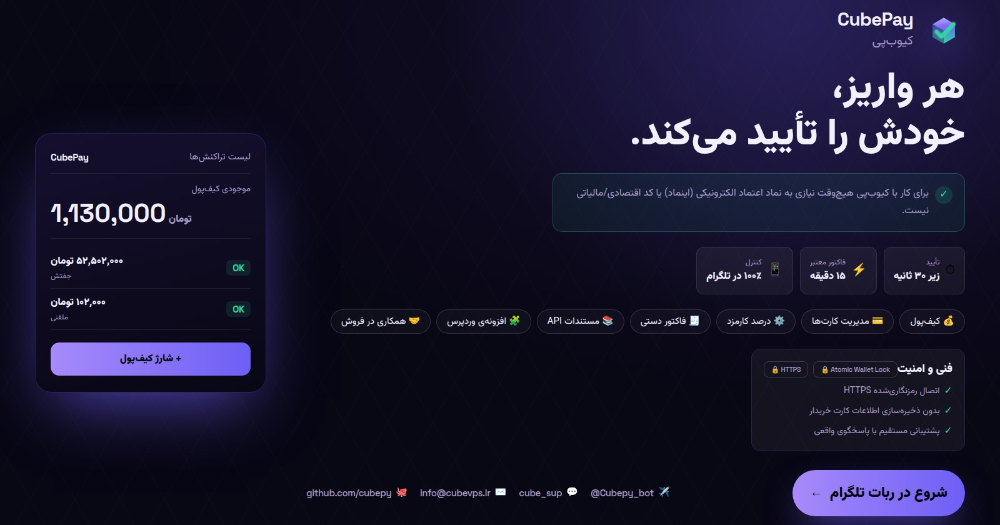
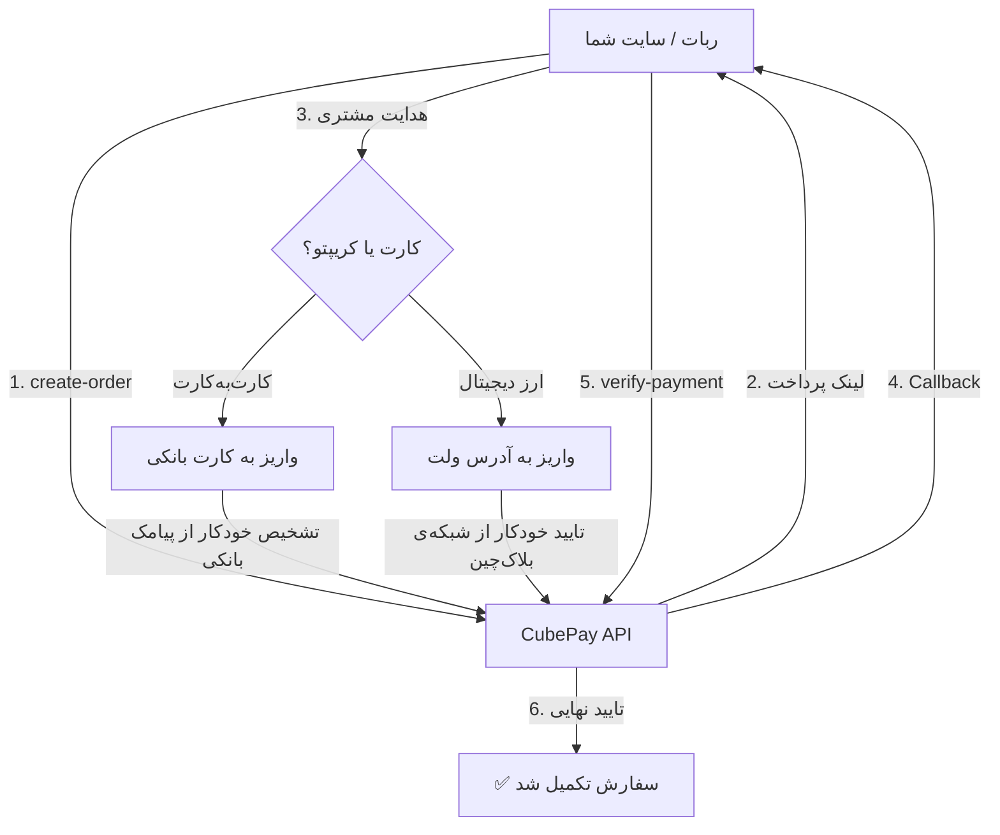

<p align="center">
  
</p>

<p align="center">
  <a href="https://github.com/cubepy/cubepay-doc/releases"></a>
  <a href="https://github.com/cubepy/cubepay-doc/blob/main/LICENSE"></a>
  <a href="https://github.com/cubepy/cubepay-doc/stargazers"></a>
  <a href="https://github.com/cubepy/cubepay-doc/network/members"></a>
  <a href="https://github.com/cubepy/cubepay-doc/issues"></a>
  <a href="https://github.com/cubepy/cubepay-doc/pulls"></a>
  <a href="https://github.com/cubepy/cubepay-doc/commits/main"></a>
</p>

<h1 align="center">💳 CubePay</h1>

<p align="center">
هر واریز، خودش را تأیید می‌کند — پرداخت کارت‌به‌کارت و ارز دیجیتال، با تشخیص خودکار پیامک بانکی یا شبکه‌ی بلاک‌چین 🚀
</p>

CubePay یک سرویس API برای ساخت و تأیید خودکار تراکنش‌هاست — چه کارت‌به‌کارت، چه ارز دیجیتال (USDT / TRX / TON). برای پرداخت کارتی، مشتری شما مبلغ رو مستقیم به کارت شما واریز می‌کنه و سیستم از روی پیامک بانکی، پرداخت رو در کمتر از ۳۰ ثانیه تشخیص و تأیید می‌کنه؛ برای پرداخت کریپتویی، مشتری خودش ارز دلخواهش رو انتخاب می‌کنه و تاییدش کاملاً خودکار از روی شبکه‌ی بلاک‌چین انجام می‌شه — بدون نیاز به نماد اعتماد الکترونیکی (اینماد)، بدون نیاز به درگاه بانکی رسمی و بدون کارمزد شتاب.

> 📌 این ریپو مستندات یک سرویس API آنلاین است، نه یک کتابخانه‌ی قابل نصب. برای شروع فقط به یک توکن API از [@cubepy_bot](https://t.me/cubepy_bot) نیاز دارید.

**تازه‌کار هستید؟ 👉 از اینجا شروع کنید: [START-HERE.md](./START-HERE.md)**

---

## ✨ امکانات

| | |
|---|---|
| ✅ تأیید خودکار پرداخت (زیر ۳۰ ثانیه) | ✅ Callback خودکار به سرور شما |
| ✅ محافظت در برابر تأیید دوباره (idempotent) | ✅ بدون نیاز به نماد یا درگاه رسمی |
| ✅ مدیریت کامل از طریق ربات تلگرام | ✅ ساخت لینک پرداخت از ربات و پنل |
| ✅ کیف پول و مدیریت چند کارت | ✅ گزارش کامل تراکنش‌ها |
| ✅ همکار حساب (چند مدیر) | ✅ اتصال HTTPS رمزنگاری‌شده |
| 🆕 پرداخت با ارز دیجیتال (USDT · TRX · TON) | 🆕 یک endpoint یکپارچه: کارت یا کریپتو، انتخاب با مشتری |

🔐 **امنیت:** بدون ذخیره‌سازی اطلاعات کارت خریدار · قفل اتمیک کیف پول (Atomic Wallet Lock) · پشتیبانی مستقیم و پاسخ‌گویی واقعی

---

## 🔌 اتصال به پلتفرم‌های آماده

اگه از یکی از این پلتفرم‌ها استفاده می‌کنید، لازم نیست خودتون API رو صفر تا صد پیاده‌سازی کنید:

| پلتفرم | راهنما | توضیح |
|---|---|---|
| 🤖 **Foxima** (نسخه‌ی ۱.۰.۰ به بعد) | [راهنمای Foxima](./integrations/faoxima-guide.md) | درگاه از قبل داخل رباته — فقط توکن API رو وارد می‌کنید |
| 🤖 **Mirzabot** (و فورک‌هاش) | [الان رسمی تو خودِ ریپو](./integrations/mirzabot-ready-files/mirzabot-ready-files-guide.md) | CubePay رسمی وارد ریپوی اصلی Mirzabot شده — فقط از upstream نصب/آپدیت کنید |
| 🌐 **وردپرس / ووکامرس** | [راهنمای وردپرس](./integrations/wordpress-plugin-guide.md) | نصب CubePay روی فروشگاه وردپرسی |
| ⚙️ **هر پلتفرم دیگه** | [راهنمای اتصال عمومی](./integrations/generic-integration-guide.md) | اتصال مستقیم به API، مستقل از پلتفرم |
| 🔀 **هر دو سیستم با هم** | [راهنمای عادی + VIP](./integrations/using-both-systems-guide.md) | اگه اشتراک VIP دارید و می‌خواید برای هر سفارش انتخاب کنید کدوم مسیر بره |

📲 برای پرداخت کارت‌به‌کارت، گوشی‌تون باید پیامک بانکی رو به CubePay بفرسته — [اندروید](./integrations/android-sms-forwarder-guide.md) · [آیفون](./integrations/ios-shortcuts-sms-forwarding-guide.md)

🖥 **سایت و ربات ندارید؟** از [پنل وب](./docs/WEB-PANEL.md) لینک پرداخت بسازید و همان لینک — یا QRش — رو بفرستید. بدون یک خط کد.

---

## 🚀 شروع سریع

یک endpoint برای هر دو نوع پرداخت — بسته به روش‌هایی که در ربات فعال کرده‌اید، خودش فاکتور کارتی یا کریپتویی می‌سازد، یا صفحه‌ی انتخاب به مشتری نشان می‌دهد:

```
POST https://cubevps.ir/pay/create-order.php
Authorization: Bearer YOUR_API_TOKEN
```

📘 جزئیات پارامترها، پاسخ‌ها و کدهای خطا → [`docs/API-REFERENCE.md`](./docs/API-REFERENCE.md)
💻 نمونه کد آماده (PHP · Python · Node.js · Laravel · cURL) → [`docs/examples/`](./docs/examples/)

---

## 🧭 نحوه‌ی کار سیستم


```mermaid
flowchart TD
    A[ربات / سایت شما] -->|"1. create-order"| B[CubePay API]
    B -->|"2. لینک پرداخت"| A
    A -->|"3. هدایت مشتری"| C{کارت یا کریپتو؟}
    C -->|کارت‌به‌کارت| D1[واریز به کارت بانکی]
    C -->|ارز دیجیتال| D2[واریز به آدرس ولت]
    D1 -->|"تشخیص خودکار از پیامک بانکی"| B
    D2 -->|"تایید خودکار از شبکه‌ی بلاک‌چین"| B
    B -->|"4. Callback"| A
    A -->|"5. verify-payment"| B
    B -->|"6. تایید نهایی"| E[✅ سفارش تکمیل شد]
```

---

## ⚖️ مقایسه با روش‌های دیگر

| ویژگی | CubePay | درگاه بانکی رسمی | کارت‌به‌کارت دستی |
|---|:---:|:---:|:---:|
| نیاز به نماد/ثبت درگاه | ❌ | ✅ | ❌ |
| تأیید خودکار پرداخت | ✅ | ✅ | ❌ |
| کارمزد شتاب | ❌ | ✅ | ❌ |
| پذیرش ارز دیجیتال | ✅ | ❌ | ❌ |
| Callback خودکار | ✅ | ✅ | ❌ |
| مدیریت از طریق ربات تلگرام | ✅ | ❌ | ❌ |
| زمان راه‌اندازی | چند دقیقه | چند روز/هفته | فوری |

> این جدول صرفاً مقایسه‌ی فنی امکانات است؛ شرایط قانونی و کارمزد واقعی هر روش رو خودتون بررسی کنید.

---

## ❓ سوالات متداول و عیب‌یابی

پرتکرارترین سوالات (پشتیبانی PHP/Node/SQLite، فعال‌سازی Auto Confirmation، خطای 401، Webhook دریافت نمی‌شه، SSL Error و…) در 👉 **[docs/FAQ.md](./docs/FAQ.md)**

---

## 🤝 مشارکت · 🔒 امنیت · 📝 تغییرات

- گزارش باگ یا Pull Request → [CONTRIBUTING.md](./CONTRIBUTING.md)
- گزارش آسیب‌پذیری امنیتی → [SECURITY.md](./SECURITY.md)
- تاریخچه‌ی نسخه‌ها → [CHANGELOG.md](./CHANGELOG.md)
- آیین رفتاری → [CODE_OF_CONDUCT.md](./CODE_OF_CONDUCT.md)
- مجوز استفاده → [LICENSE](./LICENSE)


## 🔗 لینک‌ها

🤖 ربات مدیریت فروشندگان: [@cubepy_bot](https://t.me/cubepy_bot)
💬 پشتیبانی: [cube_sup](https://t.me/cube_sup) · 📧 info@cubevps.ir
