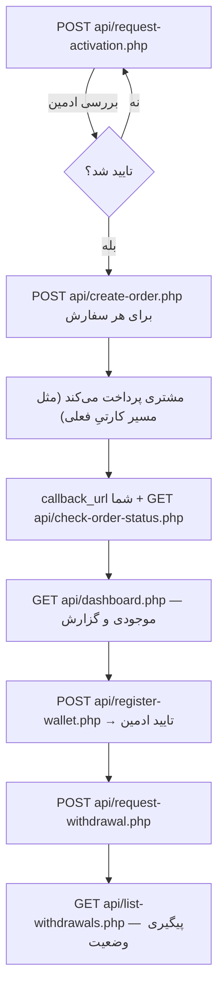

<div align="center"></div>

# 👑 مرجع API — CubePay VIP (تسویه توسط CubePay)

> ⚠️ **وضعیت:** پیاده‌سازیِ مرجعِ این ماژول آماده شده (کدِ کامل، لینت‌شده، تحویل داده شده)، ولی **هنوز روی `cubevps.ir` دیپلوی/فعال نشده**. این سند مسیرها و رفتار را طبق همون پیاده‌سازی مستند می‌کنه تا وقتی فعال بشه، مستقیم قابل‌استفاده باشه — قبل از استفاده‌ی واقعی، از تیم CubePay وضعیت فعال‌سازی رو بپرسید. برای پس‌زمینه‌ی معماری و تصمیم‌های طراحی، به [`MANAGED-SETTLEMENT-ARCHITECTURE.md`](./MANAGED-SETTLEMENT-ARCHITECTURE.md) مراجعه کنید.
>
> این قابلیت («CubePay VIP» یا «فروشنده‌های ویژه») کاملاً **اختیاری و جدا** از مسیر فعلیِ کارت‌به‌کارت/SMS Forwarder است — مستندشده در [`API-REFERENCE.md`](./API-REFERENCE.md) و [`CRYPTO-API-REFERENCE.md`](./CRYPTO-API-REFERENCE.md). فقط برای فروشنده‌هایی طراحی شده که ادمین صریحاً برایشان تأیید کرده؛ نیازی به مهاجرت یا تغییر برای بقیه‌ی فروشنده‌ها نیست.

---

## 🚀 شروع سریع

همون توکن API فعلیِ خودتون (یا `sandbox_api_token` برای تست بدون اثر واقعی) رو استفاده می‌کنید — نیازی به توکنِ جدا برای این ماژول نیست:

```
Authorization: Bearer YOUR_API_TOKEN
```

```
Base URL: https://cubevps.ir/managed-settlement/
```

### روند کامل



---

## 1️⃣ درخواست فعال‌سازی

```
POST /managed-settlement/api/request-activation.php
```

قدمِ اول و اجباری — بدون تاییدِ ادمین، هیچ endpoint دیگه‌ای تو این ماژول برای این فروشنده کار نمی‌کنه.

### ✅ نمونه پاسخ

```json
{ "success": true, "status": "pending_review", "message": "درخواستِ شما ثبت شد؛ بعد از بررسیِ ادمین فعال می‌شه." }
```

اگه دوباره صدا بزنید (قبل از تصمیمِ ادمین)، `already_requested: true` با وضعیتِ فعلی برمی‌گرده — نه خطا، نه درخواستِ تکراری.

---

## 2️⃣ ساخت فاکتور

```
POST /managed-settlement/api/create-order.php
```

تنها راهِ ساختِ فاکتور در این ماژول — بدون فاکتورِ دستی از پنل/ربات/ادمین.

### 📋 پارامترها

| نام | نوع | اجباری | توضیحات |
|---|---|---|---|
| `order_id` | string | ✅ | شناسه‌ی یکتای سفارش شما — **برخلاف مسیرِ کارتیِ فعلی، اینجا تکرارِ `order_id` برای همیشه ممنوعه** (نه فقط تا وقتی فاکتور بازه) |
| `amount_toman` | number | ✅ | مبلغ به **تومان** — سقفِ پیش‌فرض ۱ میلیون تومان (قابل‌تغییر توسط ادمین برای هر فروشنده) |
| `callback_url` | string | ❌ | آدرسِ اطلاع‌رسانیِ نتیجه‌ی نهایی |
| `customer_ref` | string | ❌ | شناسه‌ی مشتری/کاربرِ شما — فقط برای دقیق‌ترشدنِ تشخیصِ تراکنشِ مشابه استفاده می‌شه |

### ✅ نمونه پاسخ

```json
{
  "success": true,
  "invoice_uid": "b1a2c3d4-...-...-...-000000000000",
  "pay_page_url": "https://cubevps.ir/smspay/pay.php?authority=...",
  "amount_toman": 500000,
  "expires_in_minutes": 60
}
```

### ❌ خطاهای مهم

| پیام | HTTP Status | دلیل |
|---|---|---|
| مبلغ فاکتور بیشتر از سقف مجاز است | `422` | سقفِ هر‌تراکنشِ این فروشنده (پاسخ شاملِ `per_tx_limit_toman`) |
| سقف روزانه/ماهانه‌ی تسویه ... پر شده است | `422` | مجموعِ فاکتورهای پرداخت‌شده‌ی امروز/این‌ماه به سقف رسیده |
| این order_id قبلاً ... استفاده شده است | `409` | تکرارِ `order_id` — برای تغییرِ مبلغ، اول [فاکتورِ قبلی رو لغو کنید](#3-لغو-فاکتور) |
| تعداد فاکتورهای مشابه ... بیش از حد مجاز است | `429` | ضدتکرار (پیش‌فرض: ۳ فاکتورِ مشابه در ۱۵ دقیقه) |
| این فروشنده هنوز درخواست «CubePay VIP» رو ثبت نکرده | `403` | باید اول [درخواست فعال‌سازی](#1-درخواست-فعالسازی) بدید |

📌 مبلغ بعد از ساختِ فاکتور **غیرقابل‌ویرایش**ه — برای تغییرِ مبلغ، فاکتورِ قبلی رو لغو (اگه هنوز پرداخت نشده) و یکیِ جدید بسازید.

---

## 3️⃣ لغو فاکتور

```
POST /managed-settlement/api/cancel-order.php
```

| نام | نوع | اجباری | توضیحات |
|---|---|---|---|
| `invoice_uid` یا `order_id` | string | ✅ (یکی از این دو) | فاکتورِ موردنظر |

فقط فاکتورهای هنوز-پرداخت‌نشده قابل‌لغوَن. بعد از لغو، `order_id` برای فاکتورِ جدید آزاد **نمی‌شه** (چون تکرارِ `order_id` برای همیشه ممنوعه) — با یه `order_id` جدید فاکتور بسازید.

---

## 4️⃣ استعلام وضعیت فاکتور

```
GET /managed-settlement/api/check-order-status.php?invoice_uid=...
```
یا `?order_id=...`

### مقادیرِ `status`

| مقدار | معنی |
|---|---|
| `pending` | هنوز پرداخت نشده |
| `paid` | پرداخت تایید و به کیف‌پولِ شما اضافه شد |
| `expired` | مهلت تمام شد (بدون پرداخت) |
| `canceled` | خودتون لغوش کردید |
| `held_for_review` | ضدتکرار فلگش کرده — پرداخت و اعتباردهی طبیعی ادامه داره، فقط برای بررسیِ ادمین علامت خورده |

---

## 5️⃣ لیست فاکتورها

```
GET /managed-settlement/api/list-invoices.php?page=1&per_page=20&status=paid
```

`status` اختیاریه (یکی از مقادیرِ بالا). خروجی صفحه‌بندی‌شده (`page`, `per_page`, `total`).

---

## 6️⃣ ثبت آدرس کیف‌پول

```
POST /managed-settlement/api/register-wallet.php
```

| نام | نوع | اجباری | توضیحات |
|---|---|---|---|
| `currency` | string | ✅ | مثلاً `usdttrc20` |
| `network` | string | ✅ | مثلاً `TRC20` |
| `address` | string | ✅ | آدرسِ کیف‌پولِ مقصد |

هر ثبت (اولین‌بار یا تغییرِ آدرس) `verification_status: "pending"` می‌گیره — تا ادمین تاییدش نکنه (`verified`)، قابل‌استفاده برای برداشت نیست. آدرسِ قبلاً تاییدشده دست‌نخورده می‌مونه تا خودِ ادمین صریحاً غیرفعالش کنه.

---

## 7️⃣ درخواست برداشت ارزی

```
POST /managed-settlement/api/request-withdrawal.php
```

**هدر اجباری:** `Idempotency-Key: <یه‌رشته‌ی یکتا از سمتِ شما>` — اگه یه درخواست دوبار با همین کلید بره، دوبار برداشت ثبت نمی‌شه.

| نام | نوع | اجباری | توضیحات |
|---|---|---|---|
| `wallet_id` | int | ✅ | از پاسخِ `register-wallet.php` |
| `amount_toman` | number | ✅ | باید بینِ `min_withdrawal_toman` و `max_withdrawal_toman` باشه (از `dashboard.php` بخونید) |

### ✅ نمونه پاسخ

```json
{
  "success": true,
  "withdrawal_uid": "a1b2c3...",
  "status": "processing",
  "currency": "usdttrc20",
  "rate_locked": 58000.0,
  "crypto_amount_gross": 8.620000,
  "network_fee_crypto": 0.500000,
  "crypto_amount_net": 8.120000,
  "provider_payout_id": "5000123456",
  "note": "وضعیتِ نهایی از طریق webhook/بررسیِ دوره‌ای به‌روزرسانی می‌شود."
}
```

نرخِ تبدیل (`rate_locked`) دقیقاً لحظه‌ی ثبتِ همین درخواست قفل می‌شه. مبلغِ کریپتو حداکثر **۶ رقمِ اعشار** داره (محدودیتِ رسمیِ NOWPayments برایِ payout).

### وضعیت‌های ممکن (`status`)

```
requested → rate_locked → processing → sent → completed
requested → processing → failed → balance_returned
```

`failed`/`balance_returned` یعنی برداشت نهایی نشد و مبلغ خودکار به موجودیِ قابل‌تسویه‌ی شما برگشت — هیچ‌وقت هم پول از دست نمی‌ره، هم دوبار برنمی‌گرده.

---

## 8️⃣ لیست/وضعیتِ درخواست‌های برداشت

```
GET /managed-settlement/api/list-withdrawals.php?page=1&per_page=20
```

هر ردیف شاملِ `tracking_id` (شماره‌ی پیگیری نزدِ NOWPayments یا ثبت‌شده‌ی دستیِ ادمین)، `status`، و مبلغ/کارمزدهای شفاف (`crypto_amount_net`, `network_fee_crypto`, `rate_locked`).

---

## 9️⃣ داشبورد

```
GET /managed-settlement/api/dashboard.php
```

### ✅ نمونه پاسخ

```json
{
  "success": true,
  "status": "active",
  "settlement_tier": "vip",
  "payout_frequency": "daily",
  "limits": {
    "per_tx_limit_toman": 1000000,
    "daily_limit_toman": 10000000,
    "monthly_limit_toman": null,
    "min_withdrawal_toman": 500000,
    "max_withdrawal_toman": null
  },
  "today_paid_toman": 2500000,
  "this_month_paid_toman": 18500000,
  "gross_sales_toman": 42000000,
  "total_fee_toman": 4200000,
  "total_settled_toman": 30000000,
  "pending_toman": 1200000,
  "available_toman": 6600000,
  "settling_toman": 0,
  "settled_toman": 30000000
}
```

چهار موجودی (`pending_toman`, `available_toman`, `settling_toman`, `settled_toman`) دقیقاً معادلِ «در انتظار»، «قابل‌تسویه»، «در حال تسویه»، و «تسویه‌شده»ی طرح‌شده در سندِ معماریه.

---

## 🔄 اطلاعات ارسالی به `callback_url` (بعد از پرداخت فاکتور)

```json
{
  "success": true,
  "status": "paid",
  "order_id": "ORD123",
  "invoice_uid": "b1a2c3d4-...",
  "amount_toman": 500000,
  "sig": "e3b0c44298fc1c149afbf4c8996fb92427ae41e4649b934ca495991b7852b855"
}
```

مثلِ مسیر کریپتوی فعلی، `sig` رو با `api_token` خودتون دوباره بسازید و مقایسه کنید (HMAC-SHA256 روی `order_id|status|amount_toman`) — اگه مطابقت نداشت، نادیده بگیرید:

```php
$expectedSig = hash_hmac('sha256', $orderId . '|paid|' . $amountToman, $apiToken);
if (!hash_equals($expectedSig, $sig)) { exit; }
```

اگه سرورتون لحظه‌ای در دسترس نباشه، این کال‌بک تا ۳ بار با فاصله دوباره ارسال می‌شه — علاوه بر تکیه به کال‌بک، بررسیِ دوره‌ای با `check-order-status.php` هم پیشنهاد می‌شه (دقیقاً مثلِ توصیه‌ی مسیرِ کریپتویِ فعلی).

---

## ⚠️ نکات مهم

- تمام endpointهای این ماژول مبلغ رو به **تومان** می‌گیرن/می‌دن (نه ریال) — برخلافِ endpointهای کارتیِ قدیمی.
- `order_id` برای این ماژول از `order_id`های مسیرِ کارتی/کریپتویِ فعلی **کاملاً جداست** — تداخلی باهم ندارن.
- تسویه فقط **ارزی**ه؛ فعلاً هیچ مسیرِ برداشتِ ریالی/ثبتِ کارت‌وشبا در این ماژول وجود نداره.
- برای تست بدون اثرِ واقعی، از `sandbox_api_token` استفاده کنید — هیچ فراخوانیِ واقعی و هیچ ledger entry ای اتفاق نمی‌افته.

---

## 🔗 مرتبط

- 🏗️ معماریِ کامل و منطقِ داخلی: [`MANAGED-SETTLEMENT-ARCHITECTURE.md`](./MANAGED-SETTLEMENT-ARCHITECTURE.md)
- 💳 مسیرِ کارت‌به‌کارتِ فعلی (بدون تغییر): [`API-REFERENCE.md`](./API-REFERENCE.md)
- 🪙 مسیرِ کریپتوی مستقیمِ فعلی (بدون تغییر): [`CRYPTO-API-REFERENCE.md`](./CRYPTO-API-REFERENCE.md)
- 🤖 ربات مدیریت فروشندگان: [@cubepy_bot](https://t.me/cubepy_bot)
