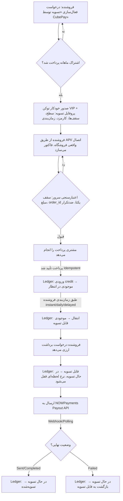

<div align="center"></div>

# 🧩 معماری «CubePay VIP» (تسویه توسط CubePay / Managed Settlement)

> ✅ **وضعیت این سند: پیاده‌سازی شد و روی `cubevps.ir` فعال است.** این سند تصمیم‌های طراحی و «چرا»یِ هر انتخاب را نگه می‌دارد؛ برای مسیرها، پارامترها و رفتارِ واقعیِ endpointها به [`CUBEPAY-VIP-API-REFERENCE.md`](./CUBEPAY-VIP-API-REFERENCE.md) مراجعه کنید. چند تصمیم حین پیاده‌سازی تغییر کرد — همه در بخش [تغییراتِ حین پیاده‌سازی](#-تغییرات-حین-پیادهسازی-نسبت-به-این-rfc) فهرست شده‌اند.
>
> این سند مکمل [`CRYPTO-API-REFERENCE.md`](./CRYPTO-API-REFERENCE.md) است، نه جایگزین آن. مسیر فعلیِ SMS Forwarder / تشخیص پیامک بانکی بدون هیچ تغییری، برای همه‌ی فروشنده‌ها، دقیقاً مثل الان باقی می‌مونه.
>
> **نام‌گذاری پیشنهادی:** این ماژول قرار نیست چیزی رو جایگزین کنه — یک لایه‌ی اضافه، برای یک زیرمجموعه‌ی خاص از فروشنده‌هاست («فروشنده‌های ویژه»). نام پیشنهادیِ محصول/مارکتینگ: **CubePay VIP**. نام دایرکتوری/جداول فنی در ادامه‌ی سند همچنان `managed-settlement` / `mst_` است (خنثی و توصیفیِ فنی)؛ سطحِ دسترسیِ `vip` همون چیزیه که این قابلیت رو در پروفایلِ فروشنده فعال می‌کنه — نگاه کنید به [بخش مدل داده](#-مدل-داده-و-ledger).

---

## 🎯 مسئله و هدف

روش فعلی CubePay برای پرداخت کارت‌به‌کارت متکی به اینه که **فروشنده** یک اپ SMS Forwarder (اندروید یا iOS Shortcuts) روی گوشیِ صاحبِ کارت نصب کنه تا پیامک بانکی به سرور CubePay فوروارد بشه. این پیش‌نیاز برای بعضی فروشنده‌ها به‌خاطر محدودیت گوشی، تنظیمات اندروید (Battery Optimization، دسترسی پیامک) یا سختی نصب، عملاً یه مانعه.

هدف این ماژول: **نه یک جایگزین برای سیستم فعلی، بلکه یک قابلیتِ موازی و اختیاری در کنارش** — برای یک زیرمجموعه‌ی مشخص از فروشنده‌ها («فروشنده‌های ویژه») که به‌جای نصب فورواردر، ترجیح می‌دن پول مستقیماً توسط CubePay جمع‌آوری و در یک کیف‌پول داخلی نگه‌داری بشه، و بعداً به‌صورت ارزی (کریپتو) برداشت کنن. چون این یک لایه‌ی تجاری/عملیاتی متفاوت از مسیر رایگان و خودکارِ فعلیه (نیازمند تأیید دستی، KYC، و نگه‌داریِ امانیِ وجه)، نام پیشنهادیِ محصول **CubePay VIP** است.

**تفاوت بنیادی با مسیر فعلی:** در مسیر SMS Forwarder، CubePay فقط «تأییدکننده»ست — پول همیشه مستقیم به کارت خودِ فروشنده می‌ره. در این ماژول، CubePay «جمع‌کننده و امانت‌دار» (custodian) پوله. این یک تغییر نقش قابل‌توجهه و باید به همین چشم (ریسک، مسئولیت، الزامات احراز هویت) بهش نگاه بشه — به بخش [نکات حقوقی و ریسک](#-نکات-حقوقی-و-ریسک-عملیاتی) توجه کنید.

---

## 🏗️ اصل طراحی: ماژول مستقل و افزودنی، نه تغییر روی مسیر موجود

- هیچ فایل، جدول یا مسیری از `smspay/` یا مسیر کارتیِ فعلی تغییر نمی‌کنه.
- فروشنده‌ای که این قابلیت رو فعال نکرده، هیچ تفاوتی تو رفتار سیستم نمی‌بینه.
- ماژول جدید (پیشنهاد نام‌گذاری: `managed-settlement/`) به‌صورت یک دایرکتوری هم‌تراز با `smspay/`, `crypto/`, `pay/`, `relay/` اضافه می‌شه — نه داخل هیچ‌کدوم:

ماژول از چند لایه‌ی مستقل تشکیل می‌شه که هیچ‌کدام به مسیرهای موجود دست نمی‌زنند:

| لایه | مسئولیت |
|---|---|
| **API عمومی** | تنها راهِ ساختِ فاکتور و ثبتِ درخواستِ برداشت — مستند در [مرجعِ API](./CUBEPAY-VIP-API-REFERENCE.md) |
| **وب‌هوک‌ها** | دریافتِ تأییدِ پرداخت و نتیجه‌ی برداشت، هر دو با اعتبارسنجیِ امضا |
| **پنلِ ادمین** | تأیید فروشنده، سقف‌ها، کارمزد، اشتراک، و تسویه‌ی دستی |
| **آداپتورِ ارائه‌دهنده** | تنها نقطه‌ای که واقعاً با NOWPayments حرف می‌زند |
| **کران‌جاب‌ها** | آزادسازیِ موجودی، انقضای فاکتور، بازبینیِ برداشت‌های گیرکرده، پایشِ نقدینگی |

> پیکربندی و مهاجرت‌ها کنارِ خودِ کد نگه‌داری می‌شوند و در این مخزنِ مستندات نیستند.

### چرا NOWPayments به‌صورت Adapter، نه وابستگیِ مستقیم؟

کتابخانه‌ی کریپتویِ فعلی (که همین حالا در پروداکشن، تسویهٔ ارزیِ فروشنده‌های مسیر کریپتو رو انجام می‌ده) به هسته‌ی مسیرِ کارتی وابسته‌ست و منطقش با فرض «موجودی از قبل داخل sub-partner NOWPayments نشسته» نوشته شده — چون تو مسیر کریپتوی فعلی، مشتری مستقیماً کریپتو پرداخت می‌کنه و همون کریپتو داخل NOWPayments می‌شینه.

این ماژول جدید با این فرض کار نمی‌کنه (پایین، بخش [نکتهٔ حیاتیِ نقدینگی](#-نکته-حیاتی-که-باید-قبل-از-پیادهسازی-حل-بشه-نقدینگی-ارزی) رو ببینید) پس به‌جای وابستگیِ مستقیم به اون کتابخانه، پیشنهاد می‌شه:

1. یک اینترفیس نازک تعریف بشه: `PayoutProviderInterface` با متدهای `estimate()`, `payout()`, `getPayoutStatus()`, `verifyIpnSignature()`.
2. یک آداپتور این اینترفیس رو با فراخوانیِ توابعِ موجودِ همون کتابخانه پیاده‌سازی کنه — یعنی از کدِ فعلی به‌عنوان کتابخانه استفاده می‌کنیم، نه اینکه کپی/بازنویسیش کنیم.
3. بقیهٔ ماژول (ledger، API، پنل ادمین) فقط با `PayoutProviderInterface` کار کنه، نه مستقیم با NOWPayments.

نتیجه: اگه روزی provider عوض بشه (یا یک provider دوم اضافه بشه)، فقط یک adapter جدید نوشته می‌شه؛ منطق مالی و Ledger دست نمی‌خوره.

---

## 🔄 جریان کامل (سفر یک تراکنش)



---

## 🗄️ مدل داده و Ledger

### اصل اول: موجودی هیچ‌وقت مستقیم UPDATE نمی‌شود

طبق درخواست صریح، هیچ ستونی مثل `balance` که مستقیم `+=`/`-=` بشه وجود نداره. هر تغییر موجودی یک ردیف مستقل و تغییرناپذیر (append-only) در دفترِ مالی ثبت می‌کنه؛ موجودیِ هر باکت (pending/available/settling/settled) از `SUM()` روی این جدول محاسبه می‌شه (با یک جدول snapshot کش‌شده برای کارایی، که فقط از روی ledger بازسازی می‌شه، هیچ‌وقت منبع حقیقت نیست).

همه‌ی داده‌های این ماژول در فضای نام‌گذاریِ کاملاً جداگانه‌ای از مسیر فعلی نگه‌داری می‌شن و فقط با شناسه‌ی فروشنده به هویتِ موجود ارجاع می‌دن — قابلیتی اضافه، نه جایگزین.

موجودیت‌های این ماژول (همه با پیشوندِ `mst_`) و نقشِ هرکدام:

| موجودیت | نقش | نکته‌ی طراحی |
|---|---|---|
| **پروفایلِ تسویه** | یک ردیف به‌ازای هر فروشنده‌ی VIP: وضعیت، سقف‌ها، درصدِ کارمزد، زمان‌بندیِ آزادسازی | سقف‌ها و کارمزد **نال‌پذیر**ند؛ نال یعنی «از پیش‌فرضِ سراسری پیروی کن»، تا تغییرِ پیش‌فرض بلافاصله به همه برسد |
| **آدرس‌های برداشت** | آدرس‌های ارزیِ ثبت‌شده، هرکدام با وضعیتِ تأیید | تغییرِ آدرس = **ردیفِ جدید + غیرفعال‌کردنِ قبلی**، نه ویرایشِ درجا؛ تا تاریخچه دست‌نخورده بماند |
| **فاکتورها** | فقط از طریق API ساخته می‌شوند | یکتاییِ `order_id` در سطحِ دیتابیس تضمین می‌شود، نه با چکِ برنامه‌ای. فاکتورِ Sandbox پرچمِ جداگانه دارد و هرگز به دفترِ واقعی نمی‌رسد |
| **دفترِ مالی** | تنها منبعِ حقیقتِ موجودی، فقط‌افزودنی | هر ردیف یک `entry_type` دارد که جهتِ حرکت را مشخص می‌کند؛ مبلغ همیشه مثبت است. یک ستونِ **کلیدِ یکتا** جلوی ثبتِ دوباره را می‌گیرد |
| **درخواست‌های برداشت** | نرخِ قفل‌شده، مبلغِ ناخالص/خالص، وضعیت، شناسه‌ی پیگیریِ ارائه‌دهنده | پاسخِ خامِ ارائه‌دهنده نگه داشته می‌شود تا هر اختلافی بعداً قابلِ ردیابی باشد |
| **ضدتکرار** | اثرانگشتِ ترکیبِ فروشنده + مبلغ + مشتری + بازه‌ی زمانی | عمداً **نه فقط مبلغ** — دو سفارشِ واقعیِ هم‌مبلغ نباید به‌اشتباه مسدود شوند |
| **تنظیماتِ سراسری** | کلید/مقدار، از پنلِ ادمین در لحظه قابلِ‌تغییر | تا تغییرِ سقف یا کارمزد نیازی به دیپلوی نداشته باشد |
| **لاگِ حسابرسی** | قبل/بعدِ هر تغییرِ ادمین | توکن‌ها قبل از نوشتن حذف می‌شوند — نگاه کنید به [بخشِ پنلِ ادمین](#-پنل-ادمین-نگاشت-به-مدل-داده) |

شش نوعِ ردیفِ دفتر، که کلِ چرخه‌ی پول را می‌سازند:

| نوع | حرکت | چه وقت |
|---|---|---|
| `invoice_paid_to_pending` | ورود به «در انتظار» | پرداختِ مشتری تأیید شد و کارمزد کسر شد |
| `pending_to_available` | «در انتظار» ← «قابل‌تسویه» | رسیدنِ زمانِ آزادسازی |
| `available_to_settling` | «قابل‌تسویه» ← «در حال تسویه» | ثبتِ درخواستِ برداشت |
| `settling_to_settled` | «در حال تسویه» ← «تسویه‌شده» | برداشت نهایی شد |
| `settling_reversed` | «در حال تسویه» ← «قابل‌تسویه» | برداشت قطعاً ناموفق شد |
| `admin_adjustment` | تعدیلِ دستی | فقط با یادداشتِ اجباری و شناسه‌ی ادمین |

> 📌 این سند عمداً **ساختارِ دقیقِ جدول‌ها را نمی‌آورد** — این‌جا مدلِ مفهومی و «چرا»ی هر تصمیم ثبت می‌شود، نه طرحِ قابلِ‌اجرا. مهاجرت‌های واقعی کنارِ خودِ کد نگه‌داری می‌شوند و بخشی از این مخزنِ مستندات نیستند.

### چرا موجودی «مشتق‌شده» است نه ذخیره‌شده

باکت‌های چهارگانه‌ی درخواستی («در انتظار»، «قابل‌تسویه»، «در حال تسویه»، «تسویه‌شده») هرکدوم دقیقاً معادل مجموع یک زیرمجموعه از `entry_type`هاست:

| باکت | فرمول |
|---|---|
| در انتظار | `SUM(invoice_paid_to_pending) − SUM(pending_to_available)` |
| قابل تسویه | `SUM(pending_to_available) − SUM(available_to_settling) + SUM(settling_reversed)` |
| در حال تسویه | `SUM(available_to_settling) − SUM(settling_to_settled) − SUM(settling_reversed)` |
| تسویه‌شده (تجمعی) | `SUM(settling_to_settled)` |

برای کارایی، یک جدول snapshot (یک جدولِ خلاصه‌ی کش‌شده) نگه داشته می‌شه که با هر INSERT روی ledger به‌روز می‌شه، ولی یک job دوره‌ای اون رو با محاسبه‌ی مستقیم از دفترِ مالی تطبیق (reconcile) می‌ده و هر مغایرت رو alert می‌کنه — یعنی snapshot صرفاً کش‌ه، هیچ‌وقت منبع تصمیم مالی نیست.

---

## 🔐 Idempotency

هر سه عملیات حساس یک `idempotency_key` می‌گیرند که `UNIQUE` هستند در سطح دیتابیس (نه فقط چک اپلیکیشنی — تا race condition هم پوشش داده بشه):

| عملیات | کلید Idempotency پیشنهادی |
|---|---|
| تأیید پرداخت فاکتور (webhook/polling) | `"invoice_paid:" + invoice_uid` |
| ثبت درخواست برداشت | فروشنده یک `Idempotency-Key` هدر می‌فرستد؛ سرور هم یک کلید داخلی می‌سازد: `"withdrawal:" + merchant_id + ":" + wallet_id + ":" + hash(amount+timestamp_bucket)` |
| پردازش IPN payout از NOWPayments | `"payout_ipn:" + provider_payout_id + ":" + status` |

الگو: هر تلاش برای INSERT با `idempotency_key` تکراری روی دفترِ مالی یا جدول‌های داخلی با خطای Unique Constraint مواجه می‌شه؛ کد اپلیکیشن این خطا رو catch می‌کنه و به‌جای شکست، همون نتیجه‌ی قبلی رو برمی‌گردونه (idempotent response) — دقیقاً همون الگویی که در `crypto/webhook/nowpayments-ipn.php` فعلی با چک `rowCount()` (هرچند به‌صورت ساده‌تر) استفاده شده.

---

## 🚦 محدودیت مبلغ (سطح بک‌اند، نه فقط پنل)

- سقف پیش‌فرض هر فاکتور/تراکنش: **۱,۰۰۰,۰۰۰ تومان**، از تنظیماتِ سراسری خوانده می‌شود؛ سقف مؤثر برای هر فروشنده از تنظیمِ اختصاصیِ پروفایل (که هنگام تأیید فروشنده، از پیش‌فرض سراسری کپی می‌شود و بعد قابل تغییر جداگانه است).
- اعتبارسنجی در `managed-settlement/api/create-order.php` **قبل از** هر INSERT انجام می‌شود؛ اگر `amount_toman` بیشتر از سقف مؤثر باشد، پاسخ با کد HTTP مناسب (`422`) و بدون ثبت هیچ رکوردی رد می‌شود. این یک چک UI/پنل نیست — روی مسیر API مستقیم هم اعمال می‌شود.
- فاکتور بعد از ایجاد **immutable** است: هیچ endpoint برای PATCH/ویرایش مبلغ وجود ندارد. برای تغییر مبلغ: فروشنده باید فاکتور را `cancel` کند (فقط اگر هنوز `pending` است) و فاکتور جدید بسازد.

---

## 🛡️ ضدتکرار / Duplicate Guard

طبق درخواست، فقط «مبلغ یکسان» معیار نیست. فینگرپرینت هر فاکتور تازه از ترکیب زیر ساخته می‌شود:

```
fingerprint = SHA256(merchant_id + "|" + amount_toman + "|" + order_id_normalized_prefix + "|" + customer_ref_if_any)
```

الگوریتم `create-order.php`:
1. فینگرپرینت فاکتور جدید را بساز.
2. تعداد ردیف‌های جدول‌های داخلی با همین `fingerprint` را در بازه‌ی `duplicate_guard_window_minutes` (پیش‌فرض ۱۵ دقیقه، از جدول‌های داخلی) بشمار.
3. اگر تعداد ≥ `duplicate_guard_max_count` (پیش‌فرض ۳) بود → فاکتور در وضعیت `held_for_review` ساخته می‌شود (نه رد قطعی) و به ادمین اطلاع داده می‌شود؛ فروشنده پاسخ HTTP با پیام روشن می‌گیرد.
4. در غیر این صورت، فاکتور عادی ساخته و یک ردیف جدید در جدول‌های داخلی ثبت می‌شود.

هر دو عدد (`max_count`, `window_minutes`) و رفتار بعد از رسیدن به حد (`hold` یا `block`) از پنل ادمین قابل تغییرند (جدول‌های داخلی).

> این مکانیزم مستقل از `UNIQUE KEY uq_merchant_order (merchant_id, order_id)` روی جدول‌های داخلی است — تکرار دقیقِ `order_id` برای یک فروشنده در هر شرایطی و بدون استثنا در سطح دیتابیس رد می‌شود؛ duplicate guard برای الگوهای *مشابه* (نه دقیقاً یکسان) طراحی شده.

---

## 🚫 عدم امکان ثبت فاکتور دستی

- هیچ endpoint یا فرم ادمین/پنل/رباتی برای «ساخت فاکتور تأییدشده» یا «افزایش مستقیم موجودی» وجود ندارد؛ تنها راه ورود پول به ledger، مسیر `invoice_paid_to_pending` است که فقط از تأیید *واقعیِ* پرداخت (وب‌هوک بانکی/تشخیص پیامک همان زیرساخت فعلی، یا معادل آن برای این ماژول) تولید می‌شود.
- فیلدهای اجباری هر فاکتور: `merchant_id`, `order_id`, `amount_toman`, `callback_url` (اختیاری)، به‌علاوه‌ی زمان ایجاد، `invoice_uid`، و وضعیت — دقیقاً هم‌راستا با ساختار فعلی `create-payment`/`create-crypto-payment`.
- **Sandbox:** فاکتورهای `is_sandbox = 1` (ساخته‌شده با توکن تستی، هم‌الگو با Sandbox Mode که طبق `CHANGELOG.md` نسخه‌ی ۲.۰.۰ همین حالا برای مسیر کارتی وجود دارد) هیچ‌وقت ردیفی در دفترِ مالی واقعی تولید نمی‌کنند — مسیر کدشان از همون ابتدا (در `create-order.php`) جدا می‌شود.
- `admin_adjustment` در دفترِ مالی تنها راهی است که یک ادمین می‌تواند موجودی را دستی تغییر دهد — و این هم «افزایش از هیچ» نیست، بلکه همیشه باید `note` و `reference` (مثلاً شناسه‌ی تیکت پشتیبانی) داشته باشد و در لاگِ حسابرسی هم ثبت شود؛ برای اصلاح خطا، نه برای ساخت فاکتور جعلی.

---

## 💸 برداشت ارزی و یکپارچگی NOWPayments

وضعیت‌ها دقیقاً طبق درخواست:

```
Requested → Rate Locked → Processing → Sent → Completed
Requested → Processing → Failed → Balance Returned
```

### نکاتی که از کد فعلی (کتابخانه‌ی کریپتویِ فعلی) قابل بازاستفاده‌اند

- **اعتبارسنجی امضای IPN** (HMAC-SHA512 با مرتب‌سازیِ بازگشتی) — دقیقاً همون منطق، بدون تغییر، برای وب‌هوکِ برداشت هم استفاده می‌شود.
- **تأیید خودکار payout با TOTP** — همون الگو.
- **کش کردنِ توکنِ احراز و نرخ تبدیل** — همون‌ها، چون از یک اکانت NOWPayments مشترک استفاده می‌شود.
- **الگوی تلاش‌مجدد کال‌بک فروشنده با بررسی نتیجه** — همون الگو برای اطلاع‌رسانی نتیجه‌ی برداشت.

### نکته‌ای که *باید* جدا طراحی شود، نه بازاستفاده

تابع فعلی تابعِ تسویه‌ی مسیرِ کریپتو فرض می‌کند موجودیِ کریپتوی قابل‌تسویه از قبل داخل **sub-partner balance** خودِ آن فروشنده روی NOWPayments نشسته (چون در مسیر کریپتوی فعلی، مشتری مستقیماً همون کریپتو رو پرداخت کرده و مستقیم به sub-partner واریز شده). در این ماژول جدید، مشتری **تومان** پرداخت کرده، نه کریپتو — یعنی هیچ موجودیِ sub-partner ای برای این فروشنده روی NOWPayments وجود ندارد. پس مسیر برداشت این ماژول باید از **master account** خود CubePay (نه از یک sub-partner) پرداخت کند — همون مسیرِ ارسالِ مستقیم که ابزارهای فعلیِ برداشتِ کارمزد هم ازش استفاده می‌کنن.

### ⚠️ نکتهٔ حیاتی که باید قبل از پیاده‌سازی حل بشه: نقدینگی ارزی

این مهم‌ترین شکافِ عملیاتی این طرح است و باید قبل از شروع کدنویسی تصمیم‌گیری بشه:

> پول ورودی این ماژول **تومانی** است (کارت‌به‌کارت). پول خروجی **ارزی** است (از master account روی NOWPayments). اما هیچ مکانیزمی در طرح فعلی وجود ندارد که تومانِ جمع‌شده را به کریپتو تبدیل و به master account واریز کند. برخلاف مسیر کریپتوی فعلی که «خودتأمین» است (مشتری خودش کریپتو می‌ریزد، همون کریپتو دوباره پرداخت می‌شود)، این ماژول به یک **خزانه‌ی ارزیِ مستقل** (crypto treasury) نیاز دارد که CubePay آن را از منبع دیگری (مثلاً صرافی) تأمین و مدیریت کند.

**تصمیمِ فازِ اول (نهایی‌شده):** تأمینِ نقدینگی همچنان یک فرآیندِ عملیاتیِ دستیه (ادمین از یک صرافی خزانه رو شارژ می‌کنه)، ولی **مانیتورینگ و هشدار خودکاره** — نه صرفاً «رصدِ دستیِ پنل». پیاده‌سازیِ مرجعِ این ماژول یک `jobs/treasury-liquidity-check.php` داره که هر ۳۰ دقیقه موجودیِ واقعیِ master account رو با مجموعِ تعهدِ لحظه‌ای (موجودیِ «قابل‌تسویه»یِ همه‌ی فروشنده‌های VIP فعال، به دلار) مقایسه می‌کنه و اگه با یک ضریبِ حاشیه‌ی اطمینانِ قابل‌تنظیم (`treasury_safety_multiplier`، پیش‌فرض ۱.۲) کسری بود، به ادمین هشدارِ تلگرامی می‌فرسته — قبل از این‌که یک درخواستِ برداشتِ واقعی با خطای provider مواجه بشه. وضعیتِ لحظه‌ای هم از پنلِ ادمین (`treasury_status`) همیشه قابل‌دیدنه. جزئیات در `managed-settlement/README.md` بخشِ «نقدینگیِ ارزی».

اگه حجمِ تسویه رشد کرد و این فرآیندِ دستی دیگه کافی نبود، فازِ بعدی می‌تونه یک اتصالِ خودکار به صرافی (تبدیلِ دوره‌ایِ بخشی از تومانِ جمع‌شده به USDT و واریز به master account) باشه؛ «برداشتِ خودکار به آدرسِ فروشنده» که در درخواستِ اولیه اومده بود، با این مدلِ «مانیتورینگِ خودکار + شارژِ دستیِ به‌موقع» هم، تا وقتی ادمین به هشدارها واکنشِ به‌موقع بده، برقراره.

### نرخ تبدیل، حداقل برداشت، شفافیت

#### 💱 نرخِ دلار به تومان — چند-منبعی با بازه‌ی سلامت

نرخِ دلار پایه‌ی همه‌ی برداشت‌هاست: `مقدارِ ارز = مبلغِ تومانی ÷ نرخ`، سپس دلار → ارز از `/estimate` خودِ NOWPayments. پس یک نرخِ غلط مستقیماً یعنی پرداختِ اشتباه — و چون نرخ در لحظه‌ی ثبتِ درخواست **قفل** می‌شود، بعداً قابلِ اصلاح نیست.

طرحِ اولیه تکْ‌منبعی بود (BrsApi) و هنگام شکست بی‌سروصدا به یک عددِ ثابت در `crypto-config.php` برمی‌گشت. مشکلش این بود که از بیرون تشخیص‌پذیر نبود: هر برداشت با نرخِ کهنه انجام می‌شد بدون اینکه کسی بفهمد. `managed-settlement/rate-provider.php` این را با چند لایه جایگزین می‌کند (بدونِ دست‌زدن به `crypto/`، تا مسیرِ کریپتویِ ۳٪ دست‌نخورده بماند):

| لایه | کار |
|---|---|
| چند منبع | BrsApi → bonbast → TGJU، به‌ترتیب |
| بازه‌ی سلامت | نرخی که بیش از `rate_sanity_band_percent` (پیش‌فرض ۱۵٪) با آخرین نرخِ معتبر فرق داشته باشد **رد** می‌شود |
| قاعده‌ی اجماع | اگر همه خارج از بازه بودند ولی دو **خانواده‌ی متفاوتِ** منبع روی عددی توافق داشتند، جهش پذیرفته می‌شود |
| بازگشتِ امن | اول آخرین نرخِ معتبرِ ذخیره‌شده، و فقط در نبودِ آن عددِ ثابتِ config |
| هشدار | پیامِ تلگرامی هنگام رد شدنِ منبع، پذیرشِ جهش، یا قطعیِ همه — با گلوگاهِ یک‌ساعته |

**چرا بازه‌ی سلامت حیاتی است:** APIهای عمومیِ ارز نرخِ **رسمیِ** IRR را می‌دهند، نه نرخِ آزاد. در سنجشِ عملی `open.er-api.com` عددِ ۱۲۶٬۵۶۷ داد در حالی که نرخِ آزاد ۱۹۲٬۰۰۰ بود — یعنی ۳۴٪ پایین‌تر، که به پرداختِ ~۵۰٪ ارزِ بیشتر منجر می‌شد. بازه‌ی سلامت دقیقاً چنین عددی را رد می‌کند. **هیچ‌وقت یک API عمومیِ ارز به این فهرست اضافه نکنید.**

**چرا اجماع لازم شد:** بدونِ آن، یک جهشِ واقعیِ بازار (که در ایران عادی است) باعث می‌شد همه‌ی منابع رد شوند و سیستم تا دخالتِ دستی با نرخِ قدیمیِ **پایین‌تر** کار کند — و نرخِ پایین‌تر یعنی ارزِ بیشتر به ازای هر تومان، یعنی دقیقاً همان ضرری که این ماژول قرار بود جلویش را بگیرد.

> ⚠️ **چرا «خانواده» و نه صرفاً تعدادِ منابع:** در سنجشِ واقعی BrsApi و TGJU عددِ **دقیقاً یکسان** برگرداندند (۱۹۲٬۸۸۰)، یعنی BrsApi همان دادهٔ TGJU را بازنشر می‌کند. توافقِ این دو «تأییدِ مستقل» نیست — اگر آن سرچشمه عددِ خراب بدهد هر دو همان را تکرار می‌کنند. پس منابع به خانواده گروه‌بندی شده‌اند (`brsapi` و `tgju` یک خانواده، `bonbast` خانواده‌ی دیگر) و اجماع حداقل دو خانواده‌ی متمایز می‌خواهد. هر منبعِ جدیدی که اضافه می‌شود باید خانواده‌اش هم مشخص شود.


- `rate_locked` روی جدول‌های داخلی لحظه‌ی ثبت درخواست ذخیره می‌شود (نه لحظه‌ی پردازش)، دقیقاً طبق درخواست.
- `min_withdrawal_amount` هر فروشنده در پروفایلِ فروشنده (یا مقدار پیش‌فرض سراسری) چک می‌شود؛ اگر استعلامِ حداقلِ مجازِ شبکه (تابع موجود در کتابخانه‌ی کریپتویِ فعلی) عدد بالاتری برگرداند، بزرگ‌تر از این دو به فروشنده نمایش داده می‌شود.
- مبلغ ارزی نهایی، نرخ تبدیل، کارمزد CubePay، و کارمزد شبکه (`network_fee_crypto`، با استعلامِ کارمزدِ شبکه موجود) هرکدام ستون جدا در جدول‌های داخلی هستند — یعنی در پنل فروشنده هرکدام به‌صورت شفاف و جدا نمایش داده می‌شوند، نه یک عدد نهاییِ ترکیبی.
- **آدرس کیف‌پول** پیش از اولین برداشت باید `verification_status = 'verified'` باشد (تأیید دستی ادمین یا واریز آزمایشیِ خیلی کوچک — تصمیم پیاده‌سازی). تغییر آدرس یعنی رکورد جدید در آدرس‌های برداشت با `verification_status = 'pending'`؛ رکورد قبلی `is_active` باقی می‌ماند تا رکورد جدید تأیید شود (فروشنده حین بررسیِ آدرس جدید، از برداشت به آدرس قدیمیِ تأییدشده محروم نمی‌شود مگر ادمین صریحاً غیرش کند).

### مدیریت شکست

- payout تا وقتی از سمت NOWPayments `Sent`/`Completed` تأیید نشده، رکوردِ برداشت هرگز `completed` نمی‌شود.
- اگر IPN دیر برسد و یک بررسیِ دوره‌ای (polling با `GET /payout/{id}` — شبیه الگوی `check-order-status.php` فعلی) لازم باشد، قبل از هر polling چک می‌شود که این `withdrawal_uid` از قبل `provider_payout_id` دارد؛ اگر ندارد یعنی هنوز اصلاً به provider ارسال نشده — در این حالت یک closed یک بار ارسال دوباره تلاش نمی‌کند، بلکه علامت `stuck` می‌خورد و به‌صورت دستی بررسی می‌شود (نه ارسال دوم خودکار، تا احتمال دوبار پرداخت از بین برود).
- شکست قطعی → یک ردیف `settling_reversed` در ledger → موجودی دقیقاً یک‌بار به «قابل تسویه» برمی‌گردد.

#### 🔒 ثابتِ بنیادی: هر برداشت **دقیقاً یک** ردیفِ پایانی دارد

سرنوشتِ نهاییِ هر برداشت یا «تسویه‌شده» است یا «برگشتی» — هرگز هر دو. اگر هر دو ثبت شوند، فروشنده هم ارز را دارد و هم موجودیِ تومانی‌اش سرِ جایش می‌ماند (و «در حال تسویه» منفی می‌شود). این ثابت با **دو لایه‌ی مستقل** نگه داشته می‌شود:

1. **کلیدِ idempotency مشترک** — هر دو ردیفِ `settling_to_settled` و `settling_reversed` کلیدِ یکسانِ `withdrawal_final:<withdrawal_uid>` می‌گیرند. چون این کلید در دفترِ مالی یکتاست، خودِ **دیتابیس** تضمین می‌کند دومی هرگز درج نشود — این لایه به درست‌بودنِ منطقِ برنامه وابسته نیست و کدِ آینده هم نمی‌تواند دورش بزند.
2. **گاردِ وضعیت** — `completed`, `balance_returned` و `failed` هر سه پایانی‌اند و هیچ مسیری (وب‌هوک، کران‌جابِ بازبینی، یا اقدامِ دستیِ ادمین) روی آن‌ها ردیفِ جدید نمی‌نویسد.

> ⚠️ نکته‌ای که در پیاده‌سازیِ اولیه از قلم افتاده بود: مسیرِ شکستِ `request-withdrawal.php` وضعیت را `failed` می‌گذارد (نه `balance_returned`)، در حالی که گاردها فقط دو وضعیتِ دیگر را پایانی می‌دانستند — پس یک برداشتِ `failed` که پولش برگشته بود، هنوز می‌توانست «تسویه‌شده» هم بشود. هر وضعیتِ پایانیِ جدیدی که در آینده اضافه شود باید به **هر سه** گارد اضافه شود؛ لایه‌ی کلیدِ مشترک دقیقاً برای همین فراموش‌شدن‌ها گذاشته شده.
- خطا و پاسخ خام provider در رکوردِ برداشت و لاگ ماژول ذخیره می‌شود؛ فروشنده در پنل خودش وضعیت و `provider_payout_id` را می‌بیند (نه پاسخ خام).

---

## 💰 موتور کارمزد

- کارمزد پیش‌فرض ۱۰٪، از تنظیماتِ سراسری، قابل override در سطح هر فروشنده — دقیقاً هم‌الگو با منطقِ کارمزدِ مسیرِ کریپتویِ فعلی.
- `fee_min_toman` / `fee_max_toman` اختیاری در سطح فروشنده؛ اگر ست شده باشند، کارمزدِ محاسبه‌شده به این بازه clamp می‌شود.
- کارمزد **در لحظه‌ی تأیید پرداخت** محاسبه و به‌صورت مقدار ثابت (نه فرمول) در همان ردیف دفترِ مالی (`fee_toman`) ذخیره می‌شود — تغییر بعدیِ نرخ در پروفایلِ فروشنده یا جدول‌های داخلی هیچ اثری روی تراکنش‌های قبلی ندارد، چون آن‌ها مقدار محاسبه‌شده را نگه داشته‌اند، نه فرمول را.

---

## 🖥️ پنل فروشنده — نگاشت به مدل داده

| نیاز | منبع داده |
|---|---|
| فروش ناخالص | مجموعِ مبلغِ فاکتورهای پرداخت‌شده |
| مجموع کارمزد CubePay | مجموعِ کارمزدِ ثبت‌شده در دفترِ مالی |
| موجودی در انتظار / قابل تسویه / در حال تسویه / تسویه‌شده | جدول باکت‌ها در بخش Ledger بالا |
| لیست پرداخت‌ها | جدول‌های داخلی |
| لیست درخواست‌های تسویه + وضعیت هرکدام + شناسه‌ی پیگیری | جدول‌های داخلی (`provider_payout_id` = شماره‌ی پیگیری) |

## 🛡️ پنل ادمین — نگاشت به مدل داده

| نیاز | منبع داده |
|---|---|
| لیست فروشنده‌های فعال، وضعیت | پروفایلِ فروشنده |
| سطح، کارمزد اختصاصی، سقف‌ها | پروفایلِ فروشنده (قابل ویرایش با ثبت خودکار در لاگِ حسابرسی) |
| زمان آزادسازی موجودی | تنظیمِ `payout_frequency` در پروفایل / `payout_delay_hours` |
| حداقل/حداکثر مبلغ تسویه | تنظیمِ `min_withdrawal_amount` در پروفایل + سقف global |
| اطلاعات حساب مقصد | آدرس‌های برداشت |
| موجودی فعلی | باکت‌های محاسبه‌شده (بخش Ledger) |
| تأیید/رد/انجام دستیِ تسویه، ثبت شماره‌ی پیگیری | تغییر رکوردِ برداشت + `provider_payout_id`، با ثبت اجباری در لاگِ حسابرسی |
| غیرفعال‌سازی موقت / محدودسازی حساب | تنظیمِ `disabled_by_admin` در پروفایل + `disabled_reason` |
| تاریخچه‌ی کامل تغییرات | لاگِ حسابرسی |

> 🔒 **توکن‌ها هیچ‌وقت در پاسخِ پنل یا در لاگ ظاهر نمی‌شوند.** کوئری‌هایی مثل `SELECT p.*` ستون‌های `vip_api_token` / `vip_sandbox_token` را هم می‌آورند، پس قبل از هر پاسخ و قبل از هر درجِ لاگِ حسابرسی از ردیف حذف می‌شوند (تابعِ پاک‌سازیِ توکن، که داخلِ خودِ تابعِ ثبتِ لاگِ حسابرسی صدا زده می‌شود تا فراخوان‌های آینده هم نتوانند ناخواسته توکن لو بدهند). توکنِ VIP فقط در پاسخِ مستقیمِ `subscription_grant` و `vip_token_regenerate` برمی‌گردد — همان‌جا که ادمین صریحاً درخواستش کرده.

---

## ⚖️ نکات حقوقی و ریسک عملیاتی

این بخش نتیجه‌ی بررسیِ معماری است، نه تصمیم نهایی — قبل از پیاده‌سازی باید توسط تیم CubePay (و در صورت نیاز مشاور حقوقی) تأیید بشه:

- **تغییر نقش CubePay:** در این ماژول، CubePay دیگر صرفاً «تأییدکننده‌ی پیامک» نیست؛ پول مشتریِ نهایی مستقیماً و به‌طور موقت نزد CubePay می‌ماند تا فروشنده برداشت کند. این یعنی مسئولیت‌های امانت‌داری (custody) که در مسیر فعلی اصلاً مطرح نبود، اینجا مطرح می‌شود.
- **تسویه‌ی فقط ارزی، بدون احراز حساب بانکی/شبا:** طبق درخواست، عمداً بخش برداشت ریالی و ثبت شماره‌کارت/شبا در فاز اول طراحی نمی‌شود. این تصمیم فنی درسته (محدوده‌ی کار رو کوچیک نگه می‌داره)، اما از منظر ریسک، یعنی تنها هویتِ گیرنده‌ی نهاییِ وجه، یک آدرس کیف‌پول کریپتوییه که لزوماً به هویت احراز‌شده گره نخورده. پیشنهاد می‌شود احراز هویت فروشنده (KYC سبک — که ادمین در مرحله‌ی «بررسی و تأیید درخواست فعال‌سازی» انجام می‌دهد) از تسویه‌ی ارزی جدا در نظر گرفته نشود؛ یعنی تأیید ادمین در قدم ۱ باید شامل احراز هویت واقعیِ فروشنده باشد، نه فقط تأیید فنی.
- **بدون امکان استرداد ساده:** چون پول دیگر مستقیم به کارت فروشنده نمی‌رود، مسیر «مشتری اشتباه پرداخت کرد / درخواست استرداد داد» باید از ابتدا در طراحیِ فاز بعد (خارج از این سند) دیده شود — الان در مدل داده جایی برای refund پیش‌بینی نشده.
- **سقف‌های محافظه‌کارانه در فاز اول:** سقف پیش‌فرض ۱ میلیون تومان به‌ازای هر تراکنش و محدودیت روزانه/ماهانه‌ی قابل‌تنظیم، دقیقاً برای کوچک نگه‌داشتن ریسکِ نقدینگی و امانت‌داری در فاز اول طراحی شده — پیشنهاد می‌شود این سقف‌ها فقط بعد از دوره‌ی آزمایشیِ موفق با چند فروشنده‌ی محدود بالا برود.

---

## 🧪 راه‌اندازی تدریجی

1. **Sandbox کامل اول:** تمام API این ماژول را با `is_sandbox=1` قبل از هر فروشنده‌ی واقعی تست کنید — هیچ اثری روی master account NOWPayments یا ledger واقعی ندارد.
2. **Feature flag در سطح فروشنده:** فقط فروشنده‌هایی که پروفایلشان فعال است اجازه‌ی ساخت فاکتور در این ماژول را دارند؛ بقیه همچنان روی مسیر فعلی هستند و اصلاً به این جداول برخورد نمی‌کنند.
3. **گروه آزمایشی کوچک:** قبل از باز کردن عمومی، با ۲-۳ فروشنده‌ی داوطلب و سقف‌های پایین‌تر از پیش‌فرض اجرا کنید تا فرآیند نقدینگیِ ارزی (بخش بالا) و duplicate guard در شرایط واقعی سنجیده شود.
4. **مهاجرت additive-only:** مهاجرت فقط ساختارهای جدید می‌سازد؛ تنها تغییر روی داده‌های موجود، در صورت نیاز، یک ستونِ اختیاریِ ارجاع است — چیزی حذف یا تغییرِ نوع داده نمی‌شود.

---

## 🔧 تغییراتِ حین پیاده‌سازی (نسبت به این RFC)

این موارد در عمل تغییر کردند؛ سندِ مرجعِ API واقعیت را نشان می‌دهد:

| موضوع | RFC اولیه | چیزی که پیاده شد | چرا |
|---|---|---|---|
| **مدلِ فعال‌سازی** | درخواستِ فروشنده + تأییدِ دستیِ ادمین | **اشتراکِ ماهانه** با پرداختِ ارزیِ NOWPayments؛ تأیید خودکار پس از پرداخت | درآمدِ قابل‌پیش‌بینی و حذفِ گلوگاهِ دستیِ ادمین |
| **احراز هویت** | همان توکنِ API عادیِ فروشنده | **توکنِ اختصاصیِ VIP** (`vip_` / `vipsb_`) | با انقضای اشتراک باید فقط دسترسیِ VIP قطع شود، نه کلِ حسابِ فروشنده |
| **گِیتِ کیف‌پولِ کارمزد** | ضمنی (از تابعِ احرازِ مسیرِ عادی می‌آمد) | **کاملاً حذف شد** (یک تابعِ احرازِ سبکِ اختصاصی) | کیف‌پولِ کارمزد فقط مالِ فروشنده‌های عادی است؛ VIP نباید به آن وابسته باشد |
| **دقتِ مبلغِ برداشت** | ۸ رقمِ اعشار | **۶ رقم** (`DECIMAL(24,6)` + گِردکردن) | محدودیتِ رسمیِ NOWPayments برای payout |
| **وضعیت‌های payout** | `sent` / `confirmed` / `expired` | مقادیرِ واقعی: `finished` موفق؛ `failed`/`rejected`/`rejected_not_checked`/`cancelled` ناموفق | مقادیرِ اولیه حدسی بودند و در API واقعی وجود ندارند |
| **`ipn_callback_url` برای payout** | تصور می‌شد تنظیمِ دشبورد است | **فیلدِ بدنه‌ی درخواست** است — بدون آن هیچ webhookی نمی‌رسد | بدون این، هر برداشت تا ابد `processing` می‌ماند |
| **نقدینگیِ خزانه** | ❗ باز | شارژِ دستی + کران‌جابِ پایشِ موجودی (`treasury-liquidity-check.php`) | تصمیمِ عملیاتی گرفته شد |
| **رزروِ موجودیِ VIP** | دیده نشده بود | گاردِ گاردِ رزروِ موجودیِ VIP روی «برداشتِ کلِ کارمزد» | حسابِ NOWPayments بینِ VIP و مسیرِ ۳٪ مشترک است |
| **سقفِ ماهانه** | بدونِ پیش‌فرضِ سراسری؛ فقط اگر ادمین برای همان فروشنده ست می‌کرد | پیش‌فرضِ سراسریِ `default_monthly_limit_toman` (اولیه: ۱۰۰ میلیون تومان)، با تفکیکِ `NULL` (پیروی از پیش‌فرض) از `0` (بدونِ سقف) | سقف باید روی همه اعمال شود، نه فقط روی کسی که دستی تنظیم شده |

### باگ‌هایی که در تستِ واقعی پیدا و رفع شدند

- **نشتِ Sandbox به دفترِ مالیِ واقعی** — کران‌جابِ آزادسازی شرطِ `is_sandbox = 0` نداشت و برای فاکتورهای آزمایشی موجودیِ واقعی می‌ساخت.
- **گیرکردنِ همیشگی در `processing`** — کوئریِ بازبینی روی `updated_at` فیلتر می‌کرد که برای رکوردِ تازه `NULL` است، و در SQL مقایسه‌ی `NULL` هیچ‌وقت `TRUE` نمی‌شود؛ با `COALESCE(updated_at, created_at)` رفع شد.
- **ضدتکرارِ بی‌اثر** — تابعِ ثبتِ اثرانگشت هیچ‌جا صدا زده نمی‌شد.
- **سقف‌های منجمد** — سقف‌های هر فروشنده به‌صورت مقدارِ ثابت کپی می‌شدند، پس تغییرِ پیش‌فرضِ سراسری به فروشنده‌های موجود نمی‌رسید؛ ستون‌ها `NULL`-پیش‌فرض شدند تا همیشه پیش‌فرضِ زنده را دنبال کنند.

---

## 📌 خلاصه‌ی وضعیت

| بخش | وضعیت |
|---|---|
| API ساخت/استعلام فاکتور، Ledger، ضدتکرار، سقف‌ها، پنل ادمین/فروشنده | ✅ پیاده‌سازی‌شده و فعال |
| اشتراکِ ماهانه + توکنِ اختصاصیِ VIP | ✅ پیاده‌سازی‌شده و فعال |
| اعتبارسنجی امضای IPN، TOTP، کش JWT/نرخ، الگوی retry کال‌بک | ♻️ بازاستفاده از کتابخانه‌ی کریپتویِ فعلی از طریق adapter |
| مسیر SMS Forwarder / کارت‌به‌کارت فعلی | ✅ بدون تغییر |
| مسیرِ کریپتویِ ۳٪ فروشنده‌های عادی | ✅ بدون تغییر — به‌جز گاردِ رزروِ موجودیِ VIP |
| تأمین نقدینگیِ خزانه‌ی ارزی برای master account | ✅ شارژِ دستی + پایشِ خودکار |
| فرآیند استرداد (refund) | ❗ خارج از دامنه‌ی این سند — نیاز به طراحی جدا |

---

🔗 مرتبط: [`docs/CUBEPAY-VIP-API-REFERENCE.md`](./CUBEPAY-VIP-API-REFERENCE.md) · [`docs/CRYPTO-API-REFERENCE.md`](./CRYPTO-API-REFERENCE.md) · [`CONTRIBUTING.md`](../CONTRIBUTING.md) · [`SECURITY.md`](../SECURITY.md)
