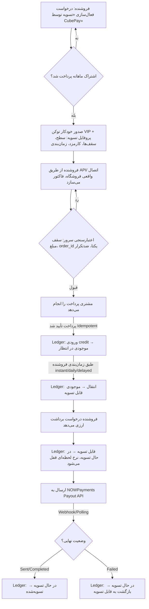

<div align="center"></div>

# 🧩 معماری «CubePay VIP» (تسویه توسط CubePay / Managed Settlement)

> ✅ **وضعیت این سند: پیاده‌سازی شد و روی `cubevps.ir` فعال است.** این سند تصمیم‌های طراحی و «چرا»یِ هر انتخاب را نگه می‌دارد؛ برای مسیرها، پارامترها و رفتارِ واقعیِ endpointها به [`CUBEPAY-VIP-API-REFERENCE.md`](./CUBEPAY-VIP-API-REFERENCE.md) مراجعه کنید. چند تصمیم حین پیاده‌سازی تغییر کرد — همه در بخش [تغییراتِ حین پیاده‌سازی](#-تغییرات-حین-پیادهسازی-نسبت-به-این-rfc) فهرست شده‌اند.
>
> این سند مکمل [`CRYPTO-API-REFERENCE.md`](./CRYPTO-API-REFERENCE.md) است، نه جایگزین آن. مسیر فعلیِ SMS Forwarder / تشخیص پیامک بانکی بدون هیچ تغییری، برای همه‌ی فروشنده‌ها، دقیقاً مثل الان باقی می‌مونه.
>
> **نام‌گذاری پیشنهادی:** این ماژول قرار نیست چیزی رو جایگزین کنه — یک لایه‌ی اضافه، برای یک زیرمجموعه‌ی خاص از فروشنده‌هاست («فروشنده‌های ویژه»). نام پیشنهادیِ محصول/مارکتینگ: **CubePay VIP**. نام دایرکتوری/جداول فنی در ادامه‌ی سند همچنان `managed-settlement` / `mst_` است (خنثی و توصیفیِ فنی)؛ `settlement_tier = 'vip'` همون سطحیه که این قابلیت رو در `mst_merchant_profile` فعال می‌کنه — نگاه کنید به [بخش مدل داده](#-مدل-داده-و-ledger).

---

## 🎯 مسئله و هدف

روش فعلی CubePay برای پرداخت کارت‌به‌کارت متکی به اینه که **فروشنده** یک اپ SMS Forwarder (اندروید یا iOS Shortcuts) روی گوشیِ صاحبِ کارت نصب کنه تا پیامک بانکی به سرور CubePay فوروارد بشه. این پیش‌نیاز برای بعضی فروشنده‌ها به‌خاطر محدودیت گوشی، تنظیمات اندروید (Battery Optimization، دسترسی پیامک) یا سختی نصب، عملاً یه مانعه.

هدف این ماژول: **نه یک جایگزین برای سیستم فعلی، بلکه یک قابلیتِ موازی و اختیاری در کنارش** — برای یک زیرمجموعه‌ی مشخص از فروشنده‌ها («فروشنده‌های ویژه») که به‌جای نصب فورواردر، ترجیح می‌دن پول مستقیماً توسط CubePay جمع‌آوری و در یک کیف‌پول داخلی نگه‌داری بشه، و بعداً به‌صورت ارزی (کریپتو) برداشت کنن. چون این یک لایه‌ی تجاری/عملیاتی متفاوت از مسیر رایگان و خودکارِ فعلیه (نیازمند تأیید دستی، KYC، و نگه‌داریِ امانیِ وجه)، نام پیشنهادیِ محصول **CubePay VIP** است.

**تفاوت بنیادی با مسیر فعلی:** در مسیر SMS Forwarder، CubePay فقط «تأییدکننده»ست — پول همیشه مستقیم به کارت خودِ فروشنده می‌ره. در این ماژول، CubePay «جمع‌کننده و امانت‌دار» (custodian) پوله. این یک تغییر نقش قابل‌توجهه و باید به همین چشم (ریسک، مسئولیت، الزامات احراز هویت) بهش نگاه بشه — به بخش [نکات حقوقی و ریسک](#-نکات-حقوقی-و-ریسک-عملیاتی) توجه کنید.

---

## 🏗️ اصل طراحی: ماژول مستقل و افزودنی، نه تغییر روی مسیر موجود

- هیچ فایل، جدول یا مسیری از `smspay/` یا مسیر کارتیِ فعلی تغییر نمی‌کنه.
- فروشنده‌ای که این قابلیت رو فعال نکرده، هیچ تفاوتی تو رفتار سیستم نمی‌بینه.
- ماژول جدید (پیشنهاد نام‌گذاری: `managed-settlement/`) به‌صورت یک دایرکتوری هم‌تراز با `smspay/`, `crypto/`, `pay/`, `relay/` اضافه می‌شه — نه داخل هیچ‌کدوم:

```
cubevps.ir/
├── smspay/                 ← بدون تغییر (کارت‌به‌کارت + SMS Forwarder)
├── crypto/                 ← بدون تغییر (پرداخت مستقیم کریپتویی مشتری)
│   └── nowpayments-lib.php ← بازاستفاده می‌شه (پایین رو ببینید)
├── pay/                    ← بدون تغییر (روتر یکپارچه کارت/کریپتو)
└── managed-settlement/     ← 🆕 ماژول جدید، کاملاً مستقل
    ├── api/
    │   ├── create-order.php          ← تنها راه ساخت فاکتور (نه دستی)
    │   ├── check-order-status.php
    │   └── request-withdrawal.php
    ├── webhook/
    │   └── nowpayments-payout-ipn.php
    ├── admin/
    │   └── api.php                   ← تأیید فروشنده، سقف‌ها، کارمزد، تسویه دستی
    ├── payout/
    │   └── payout-provider-nowpayments.php  ← adapter، نه وابستگیِ مستقیم
    ├── jobs/
    │   ├── release-pending-balance.php      ← کران‌جاب: pending → available
    │   └── duplicate-guard-sweep.php
    ├── settlement-config.php
    └── migrate-managed-settlement.sql
```

### چرا NOWPayments به‌صورت Adapter، نه وابستگیِ مستقیم؟

کد فعلیِ `crypto/nowpayments-lib.php` (که همین حالا در پروداکشن، تسویهٔ ارزیِ فروشنده‌های مسیر کریپتو رو با معماریِ sub-partner/write-off/payout انجام می‌ده) به `smspay/lib.php` وابسته‌ست (`sp_db()`, `sp_log()`) و منطقش با فرض «موجودی از قبل داخل sub-partner NOWPayments نشسته» نوشته شده — چون تو مسیر کریپتوی فعلی، مشتری مستقیماً کریپتو پرداخت می‌کنه و همون کریپتو داخل NOWPayments می‌شینه.

این ماژول جدید با این فرض کار نمی‌کنه (پایین، بخش [نکتهٔ حیاتیِ نقدینگی](#-نکته-حیاتی-که-باید-قبل-از-پیادهسازی-حل-بشه-نقدینگی-ارزی) رو ببینید) پس به‌جای import مستقیمِ `nowpayments-lib.php`، پیشنهاد می‌شه:

1. یک اینترفیس نازک تعریف بشه: `PayoutProviderInterface` با متدهای `estimate()`, `payout()`, `getPayoutStatus()`, `verifyIpnSignature()`.
2. `payout-provider-nowpayments.php` این اینترفیس رو با فراخوانیِ توابع عمومیِ موجود در `nowpayments-lib.php` (مثل `np_payout`, `np_estimate`, `np_verify_ipn_signature`) پیاده‌سازی کنه — یعنی از کد فعلی به‌عنوان یک کتابخانه استفاده می‌کنیم، نه این‌که کپی/بازنویسیش کنیم.
3. بقیهٔ ماژول (ledger، API، پنل ادمین) فقط با `PayoutProviderInterface` کار کنه، نه مستقیم با NOWPayments.

نتیجه: اگه روزی provider عوض بشه (یا یک provider دوم اضافه بشه)، فقط یک adapter جدید نوشته می‌شه؛ منطق مالی و Ledger دست نمی‌خوره.

---

## 🔄 جریان کامل (سفر یک تراکنش)



---

## 🗄️ مدل داده و Ledger

### اصل اول: موجودی هیچ‌وقت مستقیم UPDATE نمی‌شود

طبق درخواست صریح، هیچ ستونی مثل `balance` که مستقیم `+=`/`-=` بشه وجود نداره. هر تغییر موجودی یک ردیف مستقل و تغییرناپذیر (append-only) تو `mst_ledger_entries` ثبت می‌کنه؛ موجودیِ هر باکت (pending/available/settling/settled) از `SUM()` روی این جدول محاسبه می‌شه (با یک جدول snapshot کش‌شده برای کارایی، که فقط از روی ledger بازسازی می‌شه، هیچ‌وقت منبع حقیقت نیست).

پیشوند جداول این ماژول: `mst_` (Managed SeTtlement) — کاملاً جدا از `sp_` (مسیر فعلی)، فقط با `merchant_id` به `sp_merchants` ارجاع می‌ده (همون هویت فروشنده، قابلیت اضافه‌ست نه جایگزین).

```sql
-- پروفایل تسویهٔ هر فروشنده در این ماژول (فقط برای فروشنده‌های تأییدشده وجود دارد)
CREATE TABLE mst_merchant_profile (
    id                      INT AUTO_INCREMENT PRIMARY KEY,
    merchant_id             INT NOT NULL UNIQUE,               -- FK -> sp_merchants.id
    status                  ENUM('pending_review','active','suspended','rejected') NOT NULL DEFAULT 'pending_review',
    settlement_tier         VARCHAR(30) NOT NULL DEFAULT 'vip',   -- سطح دسترسی؛ 'vip' = برند فعلیِ محصول «CubePay VIP» — بستر برای سطح‌بندیِ آینده هم هست
    per_tx_limit_toman      DECIMAL(20,2) NOT NULL DEFAULT 1000000,
    daily_limit_toman       DECIMAL(20,2) NOT NULL DEFAULT 10000000,
    monthly_limit_toman     DECIMAL(20,2) NULL,  -- NULL = پیش‌فرضِ سراسری · 0 = بدون سقف · >0 = سقفِ اختصاصی
    fee_percent             DECIMAL(5,2) NOT NULL DEFAULT 10.00,
    fee_min_toman           DECIMAL(20,2) NULL,
    fee_max_toman           DECIMAL(20,2) NULL,
    payout_frequency        ENUM('instant','daily','delayed') NOT NULL DEFAULT 'daily',
    payout_delay_hours      INT NOT NULL DEFAULT 24,           -- برای حالت delayed
    min_withdrawal_amount   DECIMAL(20,2) NULL,
    disabled_by_admin       TINYINT(1) NOT NULL DEFAULT 0,
    disabled_reason         VARCHAR(255) NULL,
    created_at              DATETIME NOT NULL DEFAULT CURRENT_TIMESTAMP,
    updated_at              DATETIME NULL
) ENGINE=InnoDB DEFAULT CHARSET=utf8mb4;

-- آدرس‌های برداشتِ ثبت‌شده و تأییدشدهٔ هر فروشنده (فقط ارزی — طبق تصمیم فعلی، بدون کارت/شبا)
CREATE TABLE mst_payout_wallets (
    id                  INT AUTO_INCREMENT PRIMARY KEY,
    merchant_id         INT NOT NULL,
    currency            VARCHAR(20) NOT NULL,          -- مثلاً usdttrc20
    network             VARCHAR(20) NOT NULL,           -- مثلاً TRC20
    address             VARCHAR(255) NOT NULL,
    verification_status ENUM('pending','verified','rejected') NOT NULL DEFAULT 'pending',
    is_active           TINYINT(1) NOT NULL DEFAULT 1,  -- تغییر آدرس = رکورد جدید + غیرفعال‌کردن قبلی، نه ویرایش مستقیم
    verified_at         DATETIME NULL,
    created_at          DATETIME NOT NULL DEFAULT CURRENT_TIMESTAMP,
    KEY idx_merchant_currency (merchant_id, currency, is_active)
) ENGINE=InnoDB DEFAULT CHARSET=utf8mb4;

-- فاکتورها — فقط از طریق API، هرگز دستی
CREATE TABLE mst_invoices (
    id                  INT AUTO_INCREMENT PRIMARY KEY,
    invoice_uid         CHAR(36) NOT NULL UNIQUE,       -- UUID، شناسه‌ی عمومی
    merchant_id         INT NOT NULL,
    order_id            VARCHAR(64) NOT NULL,
    amount_toman        DECIMAL(20,2) NOT NULL,
    callback_url        VARCHAR(500) NULL,
    status              ENUM('pending','paid','expired','canceled') NOT NULL DEFAULT 'pending',
    idempotency_key     VARCHAR(128) NULL,
    is_sandbox          TINYINT(1) NOT NULL DEFAULT 0,   -- فاکتور Sandbox هرگز روی ledger واقعی اثر نمی‌گذارد
    created_at          DATETIME NOT NULL DEFAULT CURRENT_TIMESTAMP,
    paid_at             DATETIME NULL,
    UNIQUE KEY uq_merchant_order (merchant_id, order_id),   -- order_id تکراری برای یک فروشنده کاملاً ممنوع
    KEY idx_merchant_status_created (merchant_id, status, created_at)
) ENGINE=InnoDB DEFAULT CHARSET=utf8mb4;

-- دفتر تراکنش — تنها منبع حقیقتِ موجودی، append-only
CREATE TABLE mst_ledger_entries (
    id                  BIGINT AUTO_INCREMENT PRIMARY KEY,
    merchant_id         INT NOT NULL,
    entry_type          ENUM(
        'invoice_paid_to_pending',      -- +pending  (پرداخت مشتری تأیید شد، کارمزد کسر و ثبت شد)
        'pending_to_available',         -- pending -> available (رسیدن زمان آزادسازی)
        'available_to_settling',        -- available -> settling (ثبت درخواست برداشت)
        'settling_to_settled',          -- settling -> settled (payout موفق نهایی شد)
        'settling_reversed',            -- settling -> available (payout قطعاً ناموفق شد)
        'admin_adjustment'              -- فقط با یادداشت اجباری و شناسه‌ی ادمین، برای اصلاح موارد استثنایی
    ) NOT NULL,
    amount_toman        DECIMAL(20,2) NOT NULL,          -- همیشه مثبت؛ جهت از entry_type مشخص می‌شود
    fee_toman           DECIMAL(20,2) NOT NULL DEFAULT 0,
    reference_type      VARCHAR(30) NOT NULL,             -- 'invoice' | 'withdrawal' | 'admin'
    reference_id        VARCHAR(64) NOT NULL,             -- invoice_uid یا withdrawal_uid
    idempotency_key      VARCHAR(128) NOT NULL,
    created_by           VARCHAR(30) NOT NULL DEFAULT 'system',  -- 'system' یا admin_id
    note                 TEXT NULL,
    created_at           DATETIME NOT NULL DEFAULT CURRENT_TIMESTAMP,
    UNIQUE KEY uq_idempotency (idempotency_key),   -- کلید اصلیِ جلوگیری از ثبت دوباره
    KEY idx_merchant_type_created (merchant_id, entry_type, created_at)
) ENGINE=InnoDB DEFAULT CHARSET=utf8mb4;

-- درخواست‌های برداشت ارزی
CREATE TABLE mst_withdrawals (
    id                      INT AUTO_INCREMENT PRIMARY KEY,
    withdrawal_uid          CHAR(36) NOT NULL UNIQUE,
    merchant_id             INT NOT NULL,
    wallet_id               INT NOT NULL,               -- FK -> mst_payout_wallets.id (باید verified باشد)
    amount_toman_requested  DECIMAL(20,2) NOT NULL,
    rate_locked             DECIMAL(20,8) NOT NULL,      -- نرخ تومان/ارز، لحظه‌ی ثبت درخواست
    currency                VARCHAR(20) NOT NULL,
    crypto_amount_gross     DECIMAL(24,8) NOT NULL,
    cubepay_fee_toman       DECIMAL(20,2) NOT NULL,      -- کارمزد CubePay (از قبل، لحظه‌ی پرداخت محاسبه شده بود؛ اینجا فقط مرجع)
    network_fee_crypto      DECIMAL(24,8) NULL,
    crypto_amount_net       DECIMAL(24,8) NULL,
    status                  ENUM('requested','rate_locked','processing','sent','completed','failed','balance_returned') NOT NULL DEFAULT 'requested',
    provider_payout_id      VARCHAR(64) NULL,
    provider_raw_response   TEXT NULL,
    failure_reason          TEXT NULL,
    idempotency_key         VARCHAR(128) NOT NULL UNIQUE,
    created_at              DATETIME NOT NULL DEFAULT CURRENT_TIMESTAMP,
    updated_at              DATETIME NULL
) ENGINE=InnoDB DEFAULT CHARSET=utf8mb4;

-- تشخیص فاکتور/تراکنش مشابه (ضدتکرار قابل‌تنظیم)
CREATE TABLE mst_duplicate_guard (
    id                  BIGINT AUTO_INCREMENT PRIMARY KEY,
    merchant_id         INT NOT NULL,
    fingerprint         CHAR(64) NOT NULL,   -- SHA-256 روی merchant_id+amount+order_id_prefix+customer_ref
    invoice_uid         CHAR(36) NOT NULL,
    created_at          DATETIME NOT NULL DEFAULT CURRENT_TIMESTAMP,
    KEY idx_fingerprint_created (fingerprint, created_at)
) ENGINE=InnoDB DEFAULT CHARSET=utf8mb4;

-- تنظیمات سراسری، قابل‌تغییر از پنل ادمین
CREATE TABLE mst_global_config (
    config_key    VARCHAR(64) PRIMARY KEY,
    config_value  VARCHAR(255) NOT NULL,
    updated_by    VARCHAR(30) NULL,
    updated_at    DATETIME NULL
) ENGINE=InnoDB DEFAULT CHARSET=utf8mb4;
-- ردیف‌های اولیه:
-- ('default_per_tx_limit_toman', '1000000')
-- ('default_fee_percent', '10.00')
-- ('duplicate_guard_max_count', '3')
-- ('duplicate_guard_window_minutes', '15')

-- لاگ کامل هر تغییر روی پروفایل/تنظیمات/آدرس ولت — برای «مشاهده‌ی تاریخچه‌ی کامل» در پنل ادمین
CREATE TABLE mst_audit_log (
    id             BIGINT AUTO_INCREMENT PRIMARY KEY,
    merchant_id    INT NULL,
    actor          VARCHAR(30) NOT NULL,     -- admin_id یا 'system'
    action         VARCHAR(64) NOT NULL,     -- مثلاً 'wallet_change_requested', 'limit_updated', 'withdrawal_manual_approve'
    before_json    TEXT NULL,
    after_json     TEXT NULL,
    created_at     DATETIME NOT NULL DEFAULT CURRENT_TIMESTAMP
) ENGINE=InnoDB DEFAULT CHARSET=utf8mb4;
```

### چرا موجودی «مشتق‌شده» است نه ذخیره‌شده

باکت‌های چهارگانه‌ی درخواستی («در انتظار»، «قابل‌تسویه»، «در حال تسویه»، «تسویه‌شده») هرکدوم دقیقاً معادل مجموع یک زیرمجموعه از `entry_type`هاست:

| باکت | فرمول |
|---|---|
| در انتظار | `SUM(invoice_paid_to_pending) − SUM(pending_to_available)` |
| قابل تسویه | `SUM(pending_to_available) − SUM(available_to_settling) + SUM(settling_reversed)` |
| در حال تسویه | `SUM(available_to_settling) − SUM(settling_to_settled) − SUM(settling_reversed)` |
| تسویه‌شده (تجمعی) | `SUM(settling_to_settled)` |

برای کارایی، یک جدول snapshot (`mst_balance_snapshot`) نگه داشته می‌شه که با هر INSERT روی ledger به‌روز می‌شه، ولی یک job دوره‌ای اون رو با محاسبه‌ی مستقیم از `mst_ledger_entries` تطبیق (reconcile) می‌ده و هر مغایرت رو alert می‌کنه — یعنی snapshot صرفاً کش‌ه، هیچ‌وقت منبع تصمیم مالی نیست.

---

## 🔐 Idempotency

هر سه عملیات حساس یک `idempotency_key` می‌گیرند که `UNIQUE` هستند در سطح دیتابیس (نه فقط چک اپلیکیشنی — تا race condition هم پوشش داده بشه):

| عملیات | کلید Idempotency پیشنهادی |
|---|---|
| تأیید پرداخت فاکتور (webhook/polling) | `"invoice_paid:" + invoice_uid` |
| ثبت درخواست برداشت | فروشنده یک `Idempotency-Key` هدر می‌فرستد؛ سرور هم یک کلید داخلی می‌سازد: `"withdrawal:" + merchant_id + ":" + wallet_id + ":" + hash(amount+timestamp_bucket)` |
| پردازش IPN payout از NOWPayments | `"payout_ipn:" + provider_payout_id + ":" + status` |

الگو: هر تلاش برای INSERT با `idempotency_key` تکراری روی `mst_ledger_entries` یا `mst_withdrawals` با خطای Unique Constraint مواجه می‌شه؛ کد اپلیکیشن این خطا رو catch می‌کنه و به‌جای شکست، همون نتیجه‌ی قبلی رو برمی‌گردونه (idempotent response) — دقیقاً همون الگویی که در `crypto/webhook/nowpayments-ipn.php` فعلی با چک `rowCount()` (هرچند به‌صورت ساده‌تر) استفاده شده.

---

## 🚦 محدودیت مبلغ (سطح بک‌اند، نه فقط پنل)

- سقف پیش‌فرض هر فاکتور/تراکنش: **۱,۰۰۰,۰۰۰ تومان**، از `mst_global_config.default_per_tx_limit_toman` خوانده می‌شود؛ سقف مؤثر برای هر فروشنده از `mst_merchant_profile.per_tx_limit_toman` (که هنگام تأیید فروشنده، از پیش‌فرض سراسری کپی می‌شود و بعد قابل تغییر جداگانه است).
- اعتبارسنجی در `managed-settlement/api/create-order.php` **قبل از** هر INSERT انجام می‌شود؛ اگر `amount_toman` بیشتر از سقف مؤثر باشد، پاسخ با کد HTTP مناسب (`422`) و بدون ثبت هیچ رکوردی رد می‌شود. این یک چک UI/پنل نیست — روی مسیر API مستقیم هم اعمال می‌شود.
- فاکتور بعد از ایجاد **immutable** است: هیچ endpoint برای PATCH/ویرایش مبلغ وجود ندارد. برای تغییر مبلغ: فروشنده باید فاکتور را `cancel` کند (فقط اگر هنوز `pending` است) و فاکتور جدید بسازد.

---

## 🛡️ ضدتکرار / Duplicate Guard

طبق درخواست، فقط «مبلغ یکسان» معیار نیست. فینگرپرینت هر فاکتور تازه از ترکیب زیر ساخته می‌شود:

```
fingerprint = SHA256(merchant_id + "|" + amount_toman + "|" + order_id_normalized_prefix + "|" + customer_ref_if_any)
```

الگوریتم `create-order.php`:
1. فینگرپرینت فاکتور جدید را بساز.
2. تعداد ردیف‌های `mst_duplicate_guard` با همین `fingerprint` را در بازه‌ی `duplicate_guard_window_minutes` (پیش‌فرض ۱۵ دقیقه، از `mst_global_config`) بشمار.
3. اگر تعداد ≥ `duplicate_guard_max_count` (پیش‌فرض ۳) بود → فاکتور در وضعیت `held_for_review` ساخته می‌شود (نه رد قطعی) و به ادمین اطلاع داده می‌شود؛ فروشنده پاسخ HTTP با پیام روشن می‌گیرد.
4. در غیر این صورت، فاکتور عادی ساخته و یک ردیف جدید در `mst_duplicate_guard` ثبت می‌شود.

هر دو عدد (`max_count`, `window_minutes`) و رفتار بعد از رسیدن به حد (`hold` یا `block`) از پنل ادمین قابل تغییرند (`mst_global_config`).

> این مکانیزم مستقل از `UNIQUE KEY uq_merchant_order (merchant_id, order_id)` روی `mst_invoices` است — تکرار دقیقِ `order_id` برای یک فروشنده در هر شرایطی و بدون استثنا در سطح دیتابیس رد می‌شود؛ duplicate guard برای الگوهای *مشابه* (نه دقیقاً یکسان) طراحی شده.

---

## 🚫 عدم امکان ثبت فاکتور دستی

- هیچ endpoint یا فرم ادمین/پنل/رباتی برای «ساخت فاکتور تأییدشده» یا «افزایش مستقیم موجودی» وجود ندارد؛ تنها راه ورود پول به ledger، مسیر `invoice_paid_to_pending` است که فقط از تأیید *واقعیِ* پرداخت (وب‌هوک بانکی/تشخیص پیامک همان زیرساخت فعلی، یا معادل آن برای این ماژول) تولید می‌شود.
- فیلدهای اجباری هر فاکتور: `merchant_id`, `order_id`, `amount_toman`, `callback_url` (اختیاری)، به‌علاوه‌ی زمان ایجاد، `invoice_uid`، و وضعیت — دقیقاً هم‌راستا با ساختار فعلی `create-payment`/`create-crypto-payment`.
- **Sandbox:** فاکتورهای `is_sandbox = 1` (ساخته‌شده با توکن تستی، هم‌الگو با Sandbox Mode که طبق `CHANGELOG.md` نسخه‌ی ۲.۰.۰ همین حالا برای مسیر کارتی وجود دارد) هیچ‌وقت ردیفی در `mst_ledger_entries` واقعی تولید نمی‌کنند — مسیر کدشان از همون ابتدا (در `create-order.php`) جدا می‌شود.
- `admin_adjustment` در `mst_ledger_entries` تنها راهی است که یک ادمین می‌تواند موجودی را دستی تغییر دهد — و این هم «افزایش از هیچ» نیست، بلکه همیشه باید `note` و `reference` (مثلاً شناسه‌ی تیکت پشتیبانی) داشته باشد و در `mst_audit_log` هم ثبت شود؛ برای اصلاح خطا، نه برای ساخت فاکتور جعلی.

---

## 💸 برداشت ارزی و یکپارچگی NOWPayments

وضعیت‌ها دقیقاً طبق درخواست:

```
Requested → Rate Locked → Processing → Sent → Completed
Requested → Processing → Failed → Balance Returned
```

### نکاتی که از کد فعلی (`crypto/nowpayments-lib.php`) قابل بازاستفاده‌اند

- **اعتبارسنجی امضای IPN** (`np_verify_ipn_signature`, HMAC-SHA512 با ksort بازگشتی) — دقیقاً همون تابع، بدون تغییر، برای `managed-settlement/webhook/nowpayments-payout-ipn.php` هم استفاده می‌شود.
- **تأیید خودکار payout با TOTP** (`np_totp_code`, `np_verify_payout`) — همون الگو.
- **کش JWT و نرخ تبدیل** (`np_get_jwt`, `np_get_usd_toman_rate`) — همون‌ها، چون از یک اکانت NOWPayments مشترک استفاده می‌شود.
- **الگوی تلاش‌مجدد کال‌بک فروشنده با بررسی نتیجه** (`np_fire_merchant_callback`) — همون الگو برای اطلاع‌رسانی نتیجه‌ی برداشت.

### نکته‌ای که *باید* جدا طراحی شود، نه بازاستفاده

تابع فعلی `np_settle_merchant()` فرض می‌کند موجودیِ کریپتوی قابل‌تسویه از قبل داخل **sub-partner balance** خودِ آن فروشنده روی NOWPayments نشسته (چون در مسیر کریپتوی فعلی، مشتری مستقیماً همون کریپتو رو پرداخت کرده و مستقیم به sub-partner واریز شده). در این ماژول جدید، مشتری **تومان** پرداخت کرده، نه کریپتو — یعنی هیچ موجودیِ sub-partner ای برای این فروشنده روی NOWPayments وجود ندارد. پس مسیر برداشت این ماژول باید از **master account** خود CubePay (نه از یک sub-partner) پرداخت کند — همون مسیری که `np_payout()` مستقیم (بدون `np_write_off` قبلش) پیاده‌سازی می‌کند، شبیه به چیزی که `withdraw-commission.php` و `recover-stuck-payout.php` همین الان برای مصارف دیگه استفاده می‌کنن.

### ⚠️ نکتهٔ حیاتی که باید قبل از پیاده‌سازی حل بشه: نقدینگی ارزی

این مهم‌ترین شکافِ عملیاتی این طرح است و باید قبل از شروع کدنویسی تصمیم‌گیری بشه:

> پول ورودی این ماژول **تومانی** است (کارت‌به‌کارت). پول خروجی **ارزی** است (از master account روی NOWPayments). اما هیچ مکانیزمی در طرح فعلی وجود ندارد که تومانِ جمع‌شده را به کریپتو تبدیل و به master account واریز کند. برخلاف مسیر کریپتوی فعلی که «خودتأمین» است (مشتری خودش کریپتو می‌ریزد، همون کریپتو دوباره پرداخت می‌شود)، این ماژول به یک **خزانه‌ی ارزیِ مستقل** (crypto treasury) نیاز دارد که CubePay آن را از منبع دیگری (مثلاً صرافی) تأمین و مدیریت کند.

**تصمیمِ فازِ اول (نهایی‌شده):** تأمینِ نقدینگی همچنان یک فرآیندِ عملیاتیِ دستیه (ادمین از یک صرافی خزانه رو شارژ می‌کنه)، ولی **مانیتورینگ و هشدار خودکاره** — نه صرفاً «رصدِ دستیِ پنل». پیاده‌سازیِ مرجعِ این ماژول یک `jobs/treasury-liquidity-check.php` داره که هر ۳۰ دقیقه موجودیِ واقعیِ master account رو با مجموعِ تعهدِ لحظه‌ای (موجودیِ «قابل‌تسویه»یِ همه‌ی فروشنده‌های VIP فعال، به دلار) مقایسه می‌کنه و اگه با یک ضریبِ حاشیه‌ی اطمینانِ قابل‌تنظیم (`treasury_safety_multiplier`، پیش‌فرض ۱.۲) کسری بود، به ادمین هشدارِ تلگرامی می‌فرسته — قبل از این‌که یک درخواستِ برداشتِ واقعی با خطای provider مواجه بشه. وضعیتِ لحظه‌ای هم از پنلِ ادمین (`treasury_status`) همیشه قابل‌دیدنه. جزئیات در `managed-settlement/README.md` بخشِ «نقدینگیِ ارزی».

اگه حجمِ تسویه رشد کرد و این فرآیندِ دستی دیگه کافی نبود، فازِ بعدی می‌تونه یک اتصالِ خودکار به صرافی (تبدیلِ دوره‌ایِ بخشی از تومانِ جمع‌شده به USDT و واریز به master account) باشه؛ «برداشتِ خودکار به آدرسِ فروشنده» که در درخواستِ اولیه اومده بود، با این مدلِ «مانیتورینگِ خودکار + شارژِ دستیِ به‌موقع» هم، تا وقتی ادمین به هشدارها واکنشِ به‌موقع بده، برقراره.

### نرخ تبدیل، حداقل برداشت، شفافیت

- `rate_locked` روی `mst_withdrawals` لحظه‌ی ثبت درخواست ذخیره می‌شود (نه لحظه‌ی پردازش)، دقیقاً طبق درخواست.
- `min_withdrawal_amount` هر فروشنده در `mst_merchant_profile` (یا مقدار پیش‌فرض سراسری) چک می‌شود؛ اگر `np_get_min_amount()` (تابع موجود در `nowpayments-lib.php`) عدد بالاتری برگرداند، بزرگ‌تر از این دو به فروشنده نمایش داده می‌شود.
- مبلغ ارزی نهایی، نرخ تبدیل، کارمزد CubePay، و کارمزد شبکه (`network_fee_crypto`، با `np_get_payout_fee()` موجود) هرکدام ستون جدا در `mst_withdrawals` هستند — یعنی در پنل فروشنده هرکدام به‌صورت شفاف و جدا نمایش داده می‌شوند، نه یک عدد نهاییِ ترکیبی.
- **آدرس کیف‌پول** پیش از اولین برداشت باید `verification_status = 'verified'` باشد (تأیید دستی ادمین یا واریز آزمایشیِ خیلی کوچک — تصمیم پیاده‌سازی). تغییر آدرس یعنی رکورد جدید در `mst_payout_wallets` با `verification_status = 'pending'`؛ رکورد قبلی `is_active` باقی می‌ماند تا رکورد جدید تأیید شود (فروشنده حین بررسیِ آدرس جدید، از برداشت به آدرس قدیمیِ تأییدشده محروم نمی‌شود مگر ادمین صریحاً غیرش کند).

### مدیریت شکست

- payout تا وقتی از سمت NOWPayments `Sent`/`Completed` تأیید نشده، `mst_withdrawals.status` هرگز `completed` نمی‌شود.
- اگر IPN دیر برسد و یک بررسیِ دوره‌ای (polling با `GET /payout/{id}` — شبیه الگوی `check-order-status.php` فعلی) لازم باشد، قبل از هر polling چک می‌شود که این `withdrawal_uid` از قبل `provider_payout_id` دارد؛ اگر ندارد یعنی هنوز اصلاً به provider ارسال نشده — در این حالت یک closed یک بار ارسال دوباره تلاش نمی‌کند، بلکه علامت `stuck` می‌خورد و به‌صورت دستی بررسی می‌شود (نه ارسال دوم خودکار، تا احتمال دوبار پرداخت از بین برود).
- شکست قطعی → یک ردیف `settling_reversed` در ledger (idempotent با کلید `"payout_reversed:" + withdrawal_uid`) → موجودی دقیقاً یک‌بار به «قابل تسویه» برمی‌گردد.
- خطا و پاسخ خام provider در `mst_withdrawals.provider_raw_response` و لاگ ماژول ذخیره می‌شود؛ فروشنده در پنل خودش وضعیت و `provider_payout_id` را می‌بیند (نه پاسخ خام).

---

## 💰 موتور کارمزد

- کارمزد پیش‌فرض ۱۰٪، از `mst_global_config.default_fee_percent`، قابل override در سطح فروشنده (`mst_merchant_profile.fee_percent`) — دقیقاً هم‌الگو با `np_effective_fee_percent()` موجود در `nowpayments-lib.php`.
- `fee_min_toman` / `fee_max_toman` اختیاری در سطح فروشنده؛ اگر ست شده باشند، کارمزدِ محاسبه‌شده به این بازه clamp می‌شود.
- کارمزد **در لحظه‌ی تأیید پرداخت** محاسبه و به‌صورت مقدار ثابت (نه فرمول) در همان ردیف `mst_ledger_entries` (`fee_toman`) ذخیره می‌شود — تغییر بعدیِ نرخ در `mst_merchant_profile` یا `mst_global_config` هیچ اثری روی تراکنش‌های قبلی ندارد، چون آن‌ها مقدار محاسبه‌شده را نگه داشته‌اند، نه فرمول را.

---

## 🖥️ پنل فروشنده — نگاشت به مدل داده

| نیاز | منبع داده |
|---|---|
| فروش ناخالص | `SUM(amount_toman)` روی `mst_invoices WHERE status='paid'` |
| مجموع کارمزد CubePay | `SUM(fee_toman)` روی `mst_ledger_entries WHERE entry_type='invoice_paid_to_pending'` |
| موجودی در انتظار / قابل تسویه / در حال تسویه / تسویه‌شده | جدول باکت‌ها در بخش Ledger بالا |
| لیست پرداخت‌ها | `mst_invoices` |
| لیست درخواست‌های تسویه + وضعیت هرکدام + شناسه‌ی پیگیری | `mst_withdrawals` (`provider_payout_id` = شماره‌ی پیگیری) |

## 🛡️ پنل ادمین — نگاشت به مدل داده

| نیاز | منبع داده |
|---|---|
| لیست فروشنده‌های فعال، وضعیت | `mst_merchant_profile` |
| سطح، کارمزد اختصاصی، سقف‌ها | `mst_merchant_profile` (قابل ویرایش با ثبت خودکار در `mst_audit_log`) |
| زمان آزادسازی موجودی | `mst_merchant_profile.payout_frequency` / `payout_delay_hours` |
| حداقل/حداکثر مبلغ تسویه | `mst_merchant_profile.min_withdrawal_amount` + سقف global |
| اطلاعات حساب مقصد | `mst_payout_wallets` |
| موجودی فعلی | باکت‌های محاسبه‌شده (بخش Ledger) |
| تأیید/رد/انجام دستیِ تسویه، ثبت شماره‌ی پیگیری | تغییر `mst_withdrawals.status` + `provider_payout_id`، با ثبت اجباری در `mst_audit_log` |
| غیرفعال‌سازی موقت / محدودسازی حساب | `mst_merchant_profile.disabled_by_admin` + `disabled_reason` |
| تاریخچه‌ی کامل تغییرات | `mst_audit_log` |

---

## ⚖️ نکات حقوقی و ریسک عملیاتی

این بخش نتیجه‌ی بررسیِ معماری است، نه تصمیم نهایی — قبل از پیاده‌سازی باید توسط تیم CubePay (و در صورت نیاز مشاور حقوقی) تأیید بشه:

- **تغییر نقش CubePay:** در این ماژول، CubePay دیگر صرفاً «تأییدکننده‌ی پیامک» نیست؛ پول مشتریِ نهایی مستقیماً و به‌طور موقت نزد CubePay می‌ماند تا فروشنده برداشت کند. این یعنی مسئولیت‌های امانت‌داری (custody) که در مسیر فعلی اصلاً مطرح نبود، اینجا مطرح می‌شود.
- **تسویه‌ی فقط ارزی، بدون احراز حساب بانکی/شبا:** طبق درخواست، عمداً بخش برداشت ریالی و ثبت شماره‌کارت/شبا در فاز اول طراحی نمی‌شود. این تصمیم فنی درسته (محدوده‌ی کار رو کوچیک نگه می‌داره)، اما از منظر ریسک، یعنی تنها هویتِ گیرنده‌ی نهاییِ وجه، یک آدرس کیف‌پول کریپتوییه که لزوماً به هویت احراز‌شده گره نخورده. پیشنهاد می‌شود احراز هویت فروشنده (KYC سبک — که ادمین در مرحله‌ی «بررسی و تأیید درخواست فعال‌سازی» انجام می‌دهد) از تسویه‌ی ارزی جدا در نظر گرفته نشود؛ یعنی تأیید ادمین در قدم ۱ باید شامل احراز هویت واقعیِ فروشنده باشد، نه فقط تأیید فنی.
- **بدون امکان استرداد ساده:** چون پول دیگر مستقیم به کارت فروشنده نمی‌رود، مسیر «مشتری اشتباه پرداخت کرد / درخواست استرداد داد» باید از ابتدا در طراحیِ فاز بعد (خارج از این سند) دیده شود — الان در مدل داده جایی برای refund پیش‌بینی نشده.
- **سقف‌های محافظه‌کارانه در فاز اول:** سقف پیش‌فرض ۱ میلیون تومان به‌ازای هر تراکنش و محدودیت روزانه/ماهانه‌ی قابل‌تنظیم، دقیقاً برای کوچک نگه‌داشتن ریسکِ نقدینگی و امانت‌داری در فاز اول طراحی شده — پیشنهاد می‌شود این سقف‌ها فقط بعد از دوره‌ی آزمایشیِ موفق با چند فروشنده‌ی محدود بالا برود.

---

## 🧪 راه‌اندازی تدریجی

1. **Sandbox کامل اول:** تمام API این ماژول را با `is_sandbox=1` قبل از هر فروشنده‌ی واقعی تست کنید — هیچ اثری روی master account NOWPayments یا ledger واقعی ندارد.
2. **Feature flag در سطح فروشنده:** فقط فروشنده‌هایی که `mst_merchant_profile.status = 'active'` دارند اجازه‌ی ساخت فاکتور در این ماژول را دارند؛ بقیه همچنان روی مسیر فعلی هستند و اصلاً به این جداول برخورد نمی‌کنند.
3. **گروه آزمایشی کوچک:** قبل از باز کردن عمومی، با ۲-۳ فروشنده‌ی داوطلب و سقف‌های پایین‌تر از پیش‌فرض اجرا کنید تا فرآیند نقدینگیِ ارزی (بخش بالا) و duplicate guard در شرایط واقعی سنجیده شود.
4. **مهاجرت additive-only:** `migrate-managed-settlement.sql` فقط جدول‌های جدید می‌سازد؛ تنها تغییر روی جدول موجود (`sp_merchants`) در صورت نیاز، یک ستون nullable جدید است (مثلاً `sp_merchants.mst_profile_id`) — چیزی از `sp_merchants` حذف یا تغییر نوع داده نمی‌شود.

---

## 🔧 تغییراتِ حین پیاده‌سازی (نسبت به این RFC)

این موارد در عمل تغییر کردند؛ سندِ مرجعِ API واقعیت را نشان می‌دهد:

| موضوع | RFC اولیه | چیزی که پیاده شد | چرا |
|---|---|---|---|
| **مدلِ فعال‌سازی** | درخواستِ فروشنده + تأییدِ دستیِ ادمین | **اشتراکِ ماهانه** با پرداختِ ارزیِ NOWPayments؛ تأیید خودکار پس از پرداخت | درآمدِ قابل‌پیش‌بینی و حذفِ گلوگاهِ دستیِ ادمین |
| **احراز هویت** | همان توکنِ API عادیِ فروشنده | **توکنِ اختصاصیِ VIP** (`vip_` / `vipsb_`) | با انقضای اشتراک باید فقط دسترسیِ VIP قطع شود، نه کلِ حسابِ فروشنده |
| **گِیتِ کیف‌پولِ کارمزد** | ضمنی (از `sp_auth_merchant()` می‌آمد) | **کاملاً حذف شد** (`mst_auth_merchant_basic()`) | کیف‌پولِ کارمزد فقط مالِ فروشنده‌های عادی است؛ VIP نباید به آن وابسته باشد |
| **دقتِ مبلغِ برداشت** | ۸ رقمِ اعشار | **۶ رقم** (`DECIMAL(24,6)` + گِردکردن) | محدودیتِ رسمیِ NOWPayments برای payout |
| **وضعیت‌های payout** | `sent` / `confirmed` / `expired` | مقادیرِ واقعی: `finished` موفق؛ `failed`/`rejected`/`rejected_not_checked`/`cancelled` ناموفق | مقادیرِ اولیه حدسی بودند و در API واقعی وجود ندارند |
| **`ipn_callback_url` برای payout** | تصور می‌شد تنظیمِ دشبورد است | **فیلدِ بدنه‌ی درخواست** است — بدون آن هیچ webhookی نمی‌رسد | بدون این، هر برداشت تا ابد `processing` می‌ماند |
| **نقدینگیِ خزانه** | ❗ باز | شارژِ دستی + کران‌جابِ پایشِ موجودی (`treasury-liquidity-check.php`) | تصمیمِ عملیاتی گرفته شد |
| **رزروِ موجودیِ VIP** | دیده نشده بود | گاردِ `np_vip_reserved_usd()` روی «برداشتِ کلِ کارمزد» | حسابِ NOWPayments بینِ VIP و مسیرِ ۳٪ مشترک است |
| **سقفِ ماهانه** | بدونِ پیش‌فرضِ سراسری؛ فقط اگر ادمین برای همان فروشنده ست می‌کرد | پیش‌فرضِ سراسریِ `default_monthly_limit_toman` (اولیه: ۱۰۰ میلیون تومان)، با تفکیکِ `NULL` (پیروی از پیش‌فرض) از `0` (بدونِ سقف) | سقف باید روی همه اعمال شود، نه فقط روی کسی که دستی تنظیم شده |

### باگ‌هایی که در تستِ واقعی پیدا و رفع شدند

- **نشتِ Sandbox به دفترِ مالیِ واقعی** — کران‌جابِ آزادسازی شرطِ `is_sandbox = 0` نداشت و برای فاکتورهای آزمایشی موجودیِ واقعی می‌ساخت.
- **گیرکردنِ همیشگی در `processing`** — کوئریِ بازبینی روی `updated_at` فیلتر می‌کرد که برای رکوردِ تازه `NULL` است، و در SQL مقایسه‌ی `NULL` هیچ‌وقت `TRUE` نمی‌شود؛ با `COALESCE(updated_at, created_at)` رفع شد.
- **ضدتکرارِ بی‌اثر** — تابعِ ثبتِ اثرانگشت هیچ‌جا صدا زده نمی‌شد.
- **سقف‌های منجمد** — سقف‌های هر فروشنده به‌صورت مقدارِ ثابت کپی می‌شدند، پس تغییرِ پیش‌فرضِ سراسری به فروشنده‌های موجود نمی‌رسید؛ ستون‌ها `NULL`-پیش‌فرض شدند تا همیشه پیش‌فرضِ زنده را دنبال کنند.

---

## 📌 خلاصه‌ی وضعیت

| بخش | وضعیت |
|---|---|
| API ساخت/استعلام فاکتور، Ledger، ضدتکرار، سقف‌ها، پنل ادمین/فروشنده | ✅ پیاده‌سازی‌شده و فعال |
| اشتراکِ ماهانه + توکنِ اختصاصیِ VIP | ✅ پیاده‌سازی‌شده و فعال |
| اعتبارسنجی امضای IPN، TOTP، کش JWT/نرخ، الگوی retry کال‌بک | ♻️ بازاستفاده از `crypto/nowpayments-lib.php` از طریق adapter |
| مسیر SMS Forwarder / کارت‌به‌کارت فعلی | ✅ بدون تغییر |
| مسیرِ کریپتویِ ۳٪ فروشنده‌های عادی | ✅ بدون تغییر — به‌جز گاردِ رزروِ موجودیِ VIP |
| تأمین نقدینگیِ خزانه‌ی ارزی برای master account | ✅ شارژِ دستی + پایشِ خودکار |
| فرآیند استرداد (refund) | ❗ خارج از دامنه‌ی این سند — نیاز به طراحی جدا |

---

🔗 مرتبط: [`docs/CUBEPAY-VIP-API-REFERENCE.md`](./CUBEPAY-VIP-API-REFERENCE.md) · [`docs/CRYPTO-API-REFERENCE.md`](./CRYPTO-API-REFERENCE.md) · [`CONTRIBUTING.md`](../CONTRIBUTING.md) · [`SECURITY.md`](../SECURITY.md)
