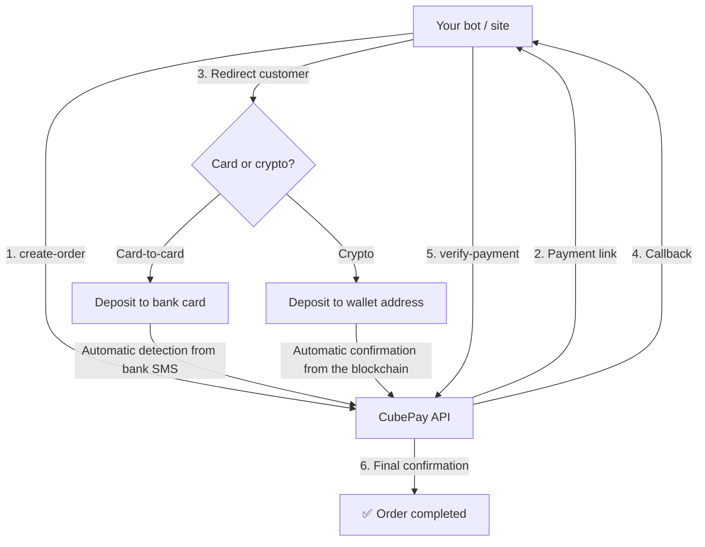

<p align="center">
  
</p>

<p align="center">
  <a href="https://github.com/cubepy/cubepay-doc/releases"></a>
  <a href="https://github.com/cubepy/cubepay-doc/blob/main/LICENSE"></a>
  <a href="https://github.com/cubepy/cubepay-doc/stargazers"></a>
  <a href="https://github.com/cubepy/cubepay-doc/network/members"></a>
  <a href="https://github.com/cubepy/cubepay-doc/issues"></a>
  <a href="https://github.com/cubepy/cubepay-doc/pulls"></a>
  <a href="https://github.com/cubepy/cubepay-doc/commits/main"></a>
</p>

<h1 align="center">💳 CubePay</h1>

<p align="center">
Every deposit verifies itself — card-to-card and crypto payments, with automatic detection from bank SMS or the blockchain 🚀
</p>

CubePay is an API service for creating and automatically confirming transactions — whether card-to-card or crypto (USDT / TRX / TON). For card payments, your customer deposits the amount directly to your own card, and the system detects and confirms the payment from the bank SMS in under 30 seconds; for crypto payments, the customer picks their preferred currency themselves, and confirmation happens fully automatically from the blockchain network — no e-commerce trust seal (Enamad), no official bank gateway, and no instant-transfer fees.

> 📌 This repo is the documentation for an online API service, not an installable library. To get started you just need an API token from [@cubepy_bot](https://t.me/cubepy_bot).

**New here? 👉 Start here: [START-HERE.md](./START-HERE.md)**

---

## ✨ Features

| | |
|---|---|
| ✅ Automatic payment confirmation (under 30 seconds) | ✅ Automatic callback to your server |
| ✅ Protection against duplicate confirmation (idempotent) | ✅ No official gateway/license required |
| ✅ Full management via Telegram bot | ✅ Create payment links from the bot and panel |
| ✅ Wallet and multi-card management | ✅ Complete transaction reports |
| ✅ Account co-owners (multiple admins) | ✅ Encrypted HTTPS connection |
| 🆕 Crypto payments (USDT · TRX · TON) | 🆕 One unified endpoint: card or crypto, chosen by the customer |

🔐 **Security:** No buyer card data is stored · Atomic Wallet Lock · Direct support with real responsiveness

---

## 🔌 Connecting to Ready-Made Platforms

If you use one of these platforms, you don't need to implement the API from scratch yourself:

| Platform | Guide | Description |
|---|---|---|
| 🤖 **Foxima** (v1.0.0 and later) | [Foxima guide](./integrations/faoxima-guide.md) | The gateway ships inside the bot — you only enter your API token |
| 🌐 **WordPress / WooCommerce** | [WordPress guide](./integrations/wordpress-plugin-guide.md) | Installing CubePay on a WordPress store |
| ⚙️ **Any other platform** | [Generic integration guide](./integrations/generic-integration-guide.md) | Direct API connection, platform-independent |

🖥 **No website or bot?** Create a payment link in the [web panel](./docs/WEB-PANEL.md) and send that link — or its QR. Not a line of code.

---

## 🚀 Quick Start

One endpoint for both payment types — depending on which methods you enabled in the bot, it creates a card invoice, a crypto invoice, or shows the customer a method-selection page:

```
POST https://cubevps.ir/pay/create-order.php
Authorization: Bearer YOUR_API_TOKEN
```

📘 Parameters, responses and error codes → [`docs/API-REFERENCE.md`](./docs/API-REFERENCE.md)
💻 Ready-made samples (PHP · Python · Node.js · Laravel · cURL) → [`docs/examples/`](./docs/examples/)

---

## 🧭 How the System Works



---

## ⚖️ Comparison With Other Methods

| Feature | CubePay | Official Bank Gateway | Manual Card-to-Card |
|---|:---:|:---:|:---:|
| Requires trust seal/gateway registration | ❌ | ✅ | ❌ |
| Automatic payment confirmation | ✅ | ✅ | ❌ |
| Instant-transfer fee | ❌ | ✅ | ❌ |
| Accepts crypto | ✅ | ❌ | ❌ |
| Automatic callback | ✅ | ✅ | ❌ |
| Managed via Telegram bot | ✅ | ❌ | ❌ |
| Setup time | Minutes | Days/weeks | Instant |

> This table is purely a technical feature comparison; check the legal requirements and actual fees of each method yourself.

---

## ❓ FAQ & Troubleshooting

The most common questions (PHP/Node/SQLite support, enabling Auto Confirmation, 401 error, webhook not received, SSL error, etc.) in 👉 **[docs/FAQ.md](./docs/FAQ.md)**

---

## 🤝 Contributing · 🔒 Security · 📝 Changelog

- Report a bug or open a Pull Request → [CONTRIBUTING.md](./CONTRIBUTING.md)
- Report a security vulnerability → [SECURITY.md](./SECURITY.md)
- Version history → [CHANGELOG.md](./CHANGELOG.md)
- Code of conduct → [CODE_OF_CONDUCT.md](./CODE_OF_CONDUCT.md)
- License → [LICENSE](../LICENSE)


## 🔗 Links

🤖 Merchant management bot: [@cubepy_bot](https://t.me/cubepy_bot)
💬 Support: [cube_sup](https://t.me/cube_sup) · 📧 info@cubevps.ir
