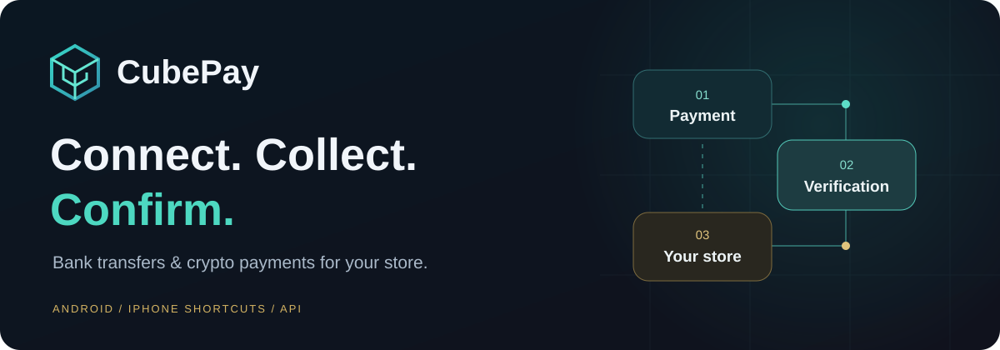
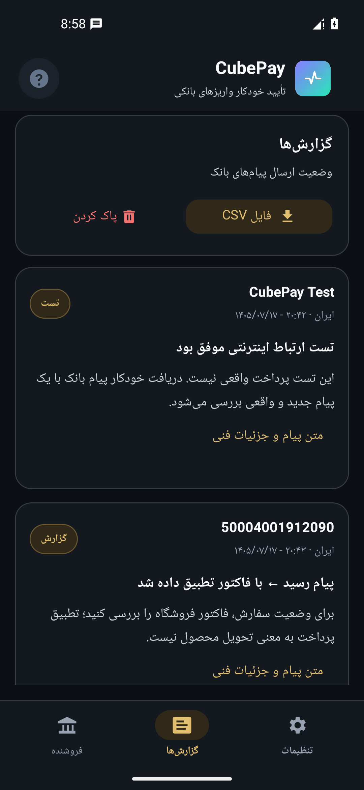
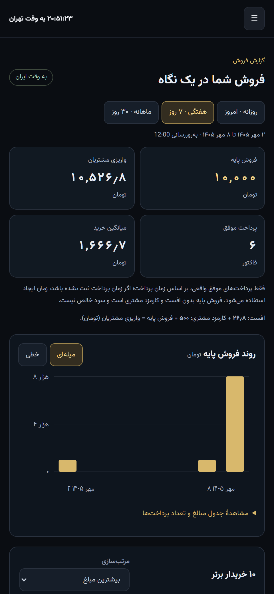
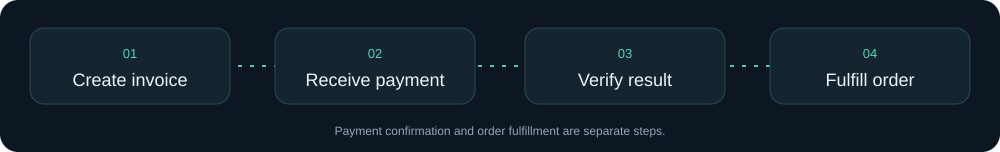

  

  
  
  

<h1 align="center">Connect customer payments to your store</h1>

Create payment links, detect bank transfers and receive results in your website or bot. Card-to-card and crypto payments, managed through Telegram and a web panel.

  <a href="./START-HERE.md"><b>Get started</b></a> ·
  <a href="https://github.com/cubepy/cubepay-doc/releases/download/android-latest/CubePay.apk"><b>Download Android</b></a> ·
  <a href="./integrations/ios-shortcuts-sms-forwarding-guide.md"><b>iPhone guide</b></a> ·
  <a href="./docs/API-REFERENCE.md"><b>API reference</b></a> ·
  <a href="https://t.me/cube_sup"><b>Support</b></a>

<a href="../README.md">🇮🇷 فارسی</a> · 🇬🇧 English

## Choose your starting point

| For merchants | For developers |
|:---|:---|
| Register with the [CubePay bot](https://t.me/cubepy_bot) and complete account approval. | Read the [integration guide](./integrations/generic-integration-guide.md), API contracts and code examples. |
| Connect bank SMS using [Android](./integrations/android-sms-forwarder-guide.md) or [iPhone](./integrations/ios-shortcuts-sms-forwarding-guide.md). | [Card payments](./docs/API-REFERENCE.md) · [Crypto and unified routing](./docs/CRYPTO-API-REFERENCE.md) · [OpenAPI](./docs/openapi.yaml) |
| Create a payment link in the [web panel](./docs/WEB-PANEL.md) or connect your store. | [PHP](./docs/examples/php-example.php) · [Python](./docs/examples/python-example.py) · [Node.js](./docs/examples/node-example.js) |

> **SMS forwarding can work without internet:** internet forwarding and SMS-to-shortcode forwarding are separate paths. The SMS path requires cellular coverage, SMS sending capability and a registered sender number. Carrier charges apply. Follow the guide for your phone.

## Inside CubePay

<table>
  <tr><th>Android forwarding reports</th><th>Merchant sales reports</th></tr>
  <tr>
    <td width="50%"></td>
    <td width="50%"></td>
  </tr>
</table>

Product UI shown with **demo data**. Forwarding reports, payment status and order fulfillment represent different stages.

## A payment, end to end

1. Your store creates an invoice or payment link.
2. The customer pays; the bank message or blockchain result is checked.
3. Your store receives and verifies the result through the API, then fulfills the order.

**Payment confirmation alone does not mean the product was delivered.** Your website or bot handles order fulfillment.

## Connect your tools

| Tool | Setup |
|:---|:---|
| Foxima | [Configure the gateway](./integrations/faoxima-guide.md) |
| Mirzabot | [Mirzabot integration guide — Persian](../integrations/mirzabot-ready-files/mirzabot-ready-files-guide.md) |
| WordPress / WooCommerce | [WordPress guide](./integrations/wordpress-plugin-guide.md) |
| Custom website or bot | [Direct API integration](./integrations/generic-integration-guide.md) |
| No website or bot | [Payment links in the web panel](./docs/WEB-PANEL.md) |

## Downloads and verifiable information

- **Official Android app:** [Download APK](https://github.com/cubepy/cubepay-doc/releases/download/android-latest/CubePay.apk) · [Release version and notes](https://github.com/cubepy/cubepay-doc/releases/tag/android-latest) · [Setup and file SHA-256](./integrations/android-sms-forwarder-guide.md).
- **iPhone:** [Internet and SMS Shortcuts guide](./integrations/ios-shortcuts-sms-forwarding-guide.md).
- **Documentation:** [Changelog](./CHANGELOG.md) · [FAQ](./docs/FAQ.md) · [Private vulnerability reporting](./SECURITY.md).
- **This repository:** documentation and integration examples for a hosted service. It does not publish the server or app source. The documentation-check badge is not a live payment-service status indicator.

Notice for existing VIP subscribers

VIP service is scheduled to end on **21 October 2026 at 23:59:59, Iran time** (29 Mehr 1405). Use the standard path for new integrations. [Legacy documentation](./docs/CUBEPAY-VIP-API-REFERENCE.md) remains available for existing subscribers.

---

[Merchant bot](https://t.me/cubepy_bot) · [Support](https://t.me/cube_sup) · [Contribute to the docs](./CONTRIBUTING.md) · [Repository license](../LICENSE)
