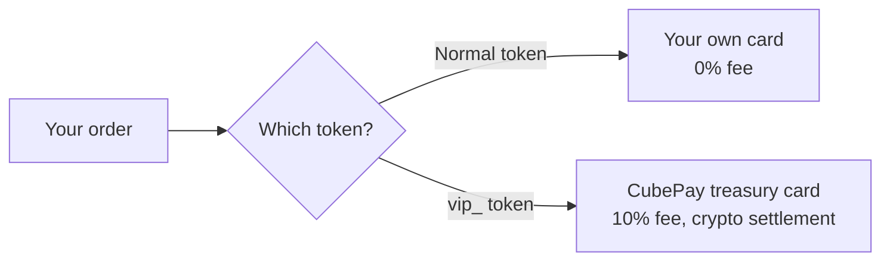

[🇮🇷 فارسی](../../integrations/using-both-systems-guide.md) · 🇬🇧 English

<div align="center"></div>

# 🔀 Running both systems together (normal + VIP)

If you have a [CubePay VIP](../docs/CUBEPAY-VIP-API-REFERENCE.md) subscription, **you don't have to choose one**. Both tokens are valid at the same time, and you can decide per order which path it takes.

This guide is for when you want both in a single integration.

---

## Why run both?

| Situation | Sensible path |
|---|---|
| Ordinary, high-frequency orders | **Normal** — no fee, money goes straight to your own card |
| When the forwarder phone is off or offline | **VIP** — detection doesn't depend on your phone |
| Customers abroad, or when you want the income in crypto | **VIP** — settles directly in crypto |
| Orders above the VIP per-invoice cap | **Normal** — VIP caps each invoice |

> Merchants who have no forwarder and only want VIP don't need this guide at all — just swap the token, as described [here](../docs/CUBEPAY-VIP-API-REFERENCE.md#-migrating-to-vip-just-swap-the-token).

---

## The core idea: one endpoint, two tokens

Both paths use **the same** `POST /pay/create-order.php` with **the same** fields. The only difference is which token you send:



## Code example

```php
$normalToken = 'YOUR_NORMAL_TOKEN';
$vipToken    = 'vip_YOUR_VIP_TOKEN';

/**
 * The selection logic is entirely yours — this is only an example.
 * Here: orders within the VIP cap go to VIP, everything else goes normal.
 */
function pickToken(int $amountToman): string
{
    global $normalToken, $vipToken;
    return $amountToman <= 1000000 ? $vipToken : $normalToken;
}

$ch = curl_init('https://cubevps.ir/pay/create-order.php');
curl_setopt_array($ch, [
    CURLOPT_RETURNTRANSFER => true,
    CURLOPT_POST => true,
    CURLOPT_HTTPHEADER => [
        'Authorization: Bearer ' . pickToken($amountToman),   // ← the only line that differs
        'Content-Type: application/json',
    ],
    CURLOPT_POSTFIELDS => json_encode([
        'order_id'     => $orderId,
        'price_amount' => $amountToman,
        'callback_url' => 'https://yoursite.com/callback.php',
    ]),
]);
$response = json_decode(curl_exec($ch), true);
curl_close($ch);

if (!empty($response['success'])) {
    header('Location: ' . $response['pay_page_url']);
    exit;
}
```

---

## ⚠️ Four things you must know

### 1) `order_id` lives in two separate namespaces

Normal and VIP `order_id`s are **fully independent** and never collide. But that also means if you use one numbering scheme, the same number can exist in both systems.

**Recommendation:** prefix them so your own reports stay unambiguous:

```php
$orderId = ($useVip ? 'v-' : 'n-') . $yourOrderNumber;
```

Also note that in VIP, reusing an `order_id` is forbidden **forever** — even after the invoice is cancelled or expires. That is not the case on the normal path.

### 2) Payment confirmation differs between the two

| | Normal path | VIP |
|---|---|---|
| Status lookup | `verify-payment.php` with `authority` | `check-order-status.php` with `invoice_uid` or `order_id` |
| Callback signing key | your API token | **the same normal API token** (not the VIP token) |

> 📌 An easy thing to get wrong: the `sig` on the VIP callback is also built with your **normal** token, not the `vip_` one. So your existing validation code works unchanged.

If the create-invoice response contains `invoice_uid`, it went through VIP — you can store that and later know which path each order took:

```php
$isVip = isset($response['invoice_uid']);
```

### 3) The money lands in two different places

- **Normal:** straight onto your own card. There is nothing to withdraw.
- **VIP:** accumulates in your internal balance, and you must [request a crypto withdrawal](../docs/CUBEPAY-VIP-API-REFERENCE.md#7-request-a-crypto-withdrawal).

So if you use both, your income sits in **two places** and you need to track both.

### 4) The fee wallet applies only to the normal path

The VIP path **never checks** the fee wallet. Even if your wallet is empty and the normal path stops working for you, VIP keeps working — as long as your subscription is valid.

---

## 🧪 Testing

Both paths have a sandbox token with no real effect:

| Path | Sandbox token |
|---|---|
| Normal | `test_…` |
| VIP | `vipsb_…` |

You can exercise your whole token-selection logic with these before going live.

---

## 🔗 Related

- 👑 Full VIP reference: [`docs/CUBEPAY-VIP-API-REFERENCE.md`](../docs/CUBEPAY-VIP-API-REFERENCE.md)
- 💳 Card-to-card reference: [`docs/API-REFERENCE.md`](../docs/API-REFERENCE.md)
- 🪙 Crypto and unified router reference: [`docs/CRYPTO-API-REFERENCE.md`](../docs/CRYPTO-API-REFERENCE.md)
- 🔌 Generic integration: [`generic-integration-guide.md`](./generic-integration-guide.md)
- 🤖 Support: [@cubepy_bot](https://t.me/cubepy_bot)
