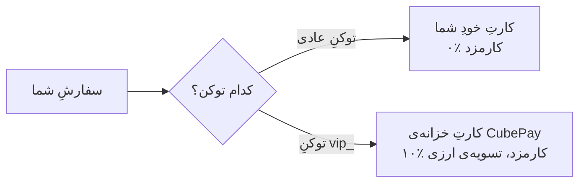

🇮🇷 فارسی · [🇬🇧 English](../en/integrations/using-both-systems-guide.md)

<div align="center"></div>

# 🔀 استفاده از هر دو سیستم با هم (عادی + VIP)

اگر اشتراکِ [CubePay VIP](../docs/CUBEPAY-VIP-API-REFERENCE.md) دارید، **مجبور نیستید یکی را انتخاب کنید.** هر دو توکن هم‌زمان معتبرند و می‌توانید برای هر سفارش تصمیم بگیرید کدام مسیر برود.

این راهنما برای وقتی است که می‌خواهید هر دو را در یک اتصال داشته باشید.

---

## چرا اصلاً هر دو؟

| موقعیت | مسیرِ منطقی |
|---|---|
| سفارش‌های معمولی و پرتکرار | **عادی** — کارمزد نمی‌دهید، پول مستقیم به کارتِ خودتان |
| وقتی گوشیِ فورواردر خاموش/بی‌اینترنت است | **VIP** — تشخیص به گوشیِ شما وابسته نیست |
| مشتری‌های خارج از ایران یا وقتی می‌خواهید درآمد ارزی شود | **VIP** — تسویه مستقیم کریپتو |
| سفارش‌های بزرگ‌تر از سقفِ VIP | **عادی** — VIP سقفِ هر فاکتور دارد |

> فروشنده‌هایی که فورواردر ندارند و فقط VIP می‌خواهند، اصلاً لازم نیست این راهنما را بخوانند — کافی است توکن را عوض کنند، [اینجا](../docs/CUBEPAY-VIP-API-REFERENCE.md#-مهاجرت-به-vip-فقط-توکن-را-عوض-کنید) توضیح داده شده.

---

## اصلِ کار: یک endpoint، دو توکن

هر دو مسیر از **همان** `POST /pay/create-order.php` با **همان** فیلدها استفاده می‌کنند. تنها تفاوت، توکنی است که می‌فرستید:



## نمونه‌ی کد

```php
$normalToken = 'توکن_عادی_شما';
$vipToken    = 'vip_توکن_vip_شما';

/**
 * منطقِ انتخاب را خودتان تعیین می‌کنید — این فقط یک نمونه است.
 * اینجا: سفارش‌های زیرِ سقفِ VIP به VIP می‌روند، بقیه به مسیرِ عادی.
 */
function pickToken(int $amountToman): string
{
    global $normalToken, $vipToken;
    return $amountToman <= 1000000 ? $vipToken : $normalToken;
}

$ch = curl_init('https://cubevps.ir/pay/create-order.php');
curl_setopt_array($ch, [
    CURLOPT_RETURNTRANSFER => true,
    CURLOPT_POST => true,
    CURLOPT_HTTPHEADER => [
        'Authorization: Bearer ' . pickToken($amountToman),   // ← تنها خطی که فرق می‌کند
        'Content-Type: application/json',
    ],
    CURLOPT_POSTFIELDS => json_encode([
        'order_id'     => $orderId,
        'price_amount' => $amountToman,
        'callback_url' => 'https://yoursite.com/callback.php',
    ]),
]);
$response = json_decode(curl_exec($ch), true);
curl_close($ch);

if (!empty($response['success'])) {
    header('Location: ' . $response['pay_page_url']);
    exit;
}
```

---

## ⚠️ چهار نکته که حتماً باید بدانید

### ۱) `order_id` دو فضای جداگانه دارد

`order_id`های مسیرِ عادی و VIP **کاملاً مستقل**اند و با هم تداخل ندارند. ولی این یعنی اگر خودتان شماره‌گذاری مشترک دارید، ممکن است یک شماره در هر دو سیستم وجود داشته باشد.

**توصیه:** پیشوند بگذارید تا در گزارش‌های خودتان قابل‌تفکیک باشد:

```php
$orderId = ($useVip ? 'v-' : 'n-') . $yourOrderNumber;
```

ضمناً در VIP تکرارِ `order_id` **برای همیشه** ممنوع است — حتی بعد از لغو یا انقضای فاکتور. در مسیرِ عادی این‌طور نیست.

### ۲) تأییدِ پرداخت در دو مسیر فرق می‌کند

| | مسیرِ عادی | VIP |
|---|---|---|
| استعلامِ وضعیت | `verify-payment.php` با `authority` | `check-order-status.php` با `invoice_uid` یا `order_id` |
| کلیدِ امضای کال‌بک | توکنِ API عادیِ شما | **توکنِ `vip_` شما** (همان که سفارش را با آن ساختید) |

> 📌 قاعده‌ی ساده: **هر کال‌بک با همان توکنی امضا می‌شود که سفارشش را ساخته‌اید.** سفارشِ کریپتوی عادی → توکنِ عادی؛ سفارشِ VIP → توکنِ `vip_`. اگر کدتان فقط یک توکن دارد (مثل فایل‌های آماده‌ی ربات‌ها)، همین خودش درست از آب درمی‌آید — چون سفارش را هم با همان توکن ساخته‌اید. فقط اگر هر دو مسیر را هم‌زمان در یک endpoint دارید، موقعِ اعتبارسنجی توکنِ متناظرِ همان سفارش را بردارید (`invoice_uid` داشتنِ کال‌بک یعنی VIP).

اگر پاسخِ ساختِ فاکتور `invoice_uid` داشت، یعنی مسیرِ VIP بوده — می‌توانید همان را ذخیره کنید و بعداً بدانید کدام سفارش کدام مسیر بوده:

```php
$isVip = isset($response['invoice_uid']);
```

### ۳) پول در دو جای متفاوت می‌نشیند

- **عادی:** مستقیم روی کارتِ خودتان. چیزی برای برداشت نیست.
- **VIP:** در موجودیِ داخلیِ شما جمع می‌شود و باید [درخواستِ برداشتِ ارزی](../docs/CUBEPAY-VIP-API-REFERENCE.md#7-درخواست-برداشت-ارزی) بدهید.

پس اگر هر دو را استفاده می‌کنید، درآمدتان در **دو جا**ست و باید هر دو را پیگیری کنید.

### ۴) کیف‌پولِ کارمزد فقط برای مسیرِ عادی است

مسیرِ VIP کیف‌پولِ کارمزد را **اصلاً چک نمی‌کند**. یعنی حتی اگر کیف‌پولتان خالی باشد و مسیرِ عادی برایتان کار نکند، مسیرِ VIP همچنان کار می‌کند (تا وقتی اشتراکتان معتبر است).

---

## 🧪 تست کردن

هر دو مسیر توکنِ آزمایشی دارند و هیچ اثرِ واقعی ندارند:

| مسیر | توکنِ آزمایشی |
|---|---|
| عادی | `test_…` |
| VIP | `vipsb_…` |

با همین‌ها می‌توانید کلِ منطقِ انتخابِ توکنِ خودتان را قبل از رفتن به حالتِ واقعی امتحان کنید.

---

## 🔗 مرتبط

- 👑 مرجعِ کاملِ VIP: [`docs/CUBEPAY-VIP-API-REFERENCE.md`](../docs/CUBEPAY-VIP-API-REFERENCE.md)
- 💳 مرجعِ کارت‌به‌کارت: [`docs/API-REFERENCE.md`](../docs/API-REFERENCE.md)
- 🪙 مرجعِ کریپتو و روترِ یکپارچه: [`docs/CRYPTO-API-REFERENCE.md`](../docs/CRYPTO-API-REFERENCE.md)
- 🔌 اتصالِ عمومی: [`generic-integration-guide.md`](./generic-integration-guide.md)
- 🤖 پشتیبانی: [@cubepy_bot](https://t.me/cubepy_bot)
